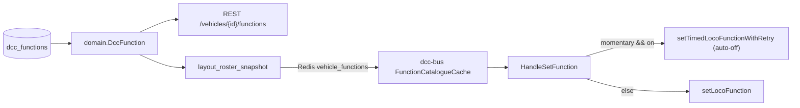

# Implementation plan — Momentary functions ("Chwilowa")

Add a per-function **momentary** attribute with an on-duration to every
vehicle/template function slot. When a momentary function is switched on, the
`dcc-bus` daemon turns it off automatically after the configured duration —
uniformly, regardless of the origin (web UI, Z21 handheld, WiThrottle).

## Starting point

- Function catalogue is stored in SQLite table `dcc_functions`
  (`pkgs/bigfred/server/domain/function.go`), edited via REST at
  `/api/v1/vehicles/{id}/functions` and
  `/api/v1/vehicle-templates/{id}/functions`.
- The catalogue is published to Redis (`vehicle_functions`) from
  `pkgs/bigfred/server/cmd/layout_roster_snapshot.go` and cached in `dcc-bus`
  by `service.FunctionCatalogueCache`, reachable via
  `Router.FunctionsForAddr(addr)`.
- Runtime on/off flows over the `dcc-bus` WebSocket (`loco.setFunction`);
  **all human sources converge in `cmd/set_function.go` `HandleSetFunction`**.
- A pulse/auto-off mechanism already exists in
  `pkgs/bigfred/dcc-bus/cmd/functions.go`
  (`setTimedLocoFunctionWithRetry` + `pulseActive` overlap guard), today used
  only for the dead-man horn. It is reused as-is.

## Confirmed design decisions

1. **Trigger point** — momentary auto-off is wired in `HandleSetFunction`.
   This covers web UI/WS, Z21 and WiThrottle. Internal paths (dead-man,
   Redis/script control) are intentionally excluded.
2. **Duration** — fractional seconds allowed, range 0–300 s. Stored on the
   wire and in the DB in milliseconds (`durationMs` / `momentary_duration_ms`).
3. **Re-press while counting down** — ignored (existing `pulseActive` guard).
4. **Scope** — applies to both vehicles and templates (shared editor +
   template inheritance). Defaults: momentary **off**, except **F2/F3**
   default to **on**; default duration **1 s**.

## Data flow (reused unchanged)



## Constants

- `MaxMomentaryDurationMs = 300_000` (300 s) — validation upper bound.
- Default duration seeded in DB: `1000` ms (also the editor default).
- Fractional seconds are supported in the UI; the wire/DB unit is always ms.

---

## Stage 1 — Persistence + REST

### 1.1 Migration — `pkgs/bigfred/server/repo/migrations/migrations.go`

Register a new version after the last entry (currently
`20260707, 1`, l.116) inside `register(...)`:

```diff
 	m.Register(migrationVersion(20260707, 1), addCommandStationBootStopEnabledColumnUp, addCommandStationBootStopEnabledColumnDown)
+	m.Register(migrationVersion(20260708, 1), addDccFunctionMomentaryColumnsUp, addDccFunctionMomentaryColumnsDown)
 }
```

Add the up/down functions next to the other `dcc_functions`/vehicle migrations
(e.g. after `addVehicleDeadManSwitchColumnsDown`, l.602). The
`20260621` table recreation (`migrate_vehicle_train_string_ids.go`) runs
earlier, so `AlterTable` is safe:

```go
// addDccFunctionMomentaryColumnsUp adds the per-function "momentary"
// attribute and its auto-off duration (ms) to dcc_functions.
func addDccFunctionMomentaryColumnsUp(s *rel.Schema) {
	s.AlterTable("dcc_functions", func(t *rel.AlterTable) {
		t.Bool("momentary", rel.Default(false))
		t.Int("momentary_duration_ms", rel.Default("1000"))
	})
}

func addDccFunctionMomentaryColumnsDown(s *rel.Schema) {
	s.AlterTable("dcc_functions", func(t *rel.AlterTable) {
		t.DropColumn("momentary")
		t.DropColumn("momentary_duration_ms")
	})
}
```

`t.Bool(..., rel.Default(false))` and `t.Int(..., rel.Default("..."))` follow
the existing patterns (`is_system`/`locked` at l.200-201, `rp1_function` at
l.590).

### 1.2 Domain — `pkgs/bigfred/server/domain/function.go`

```diff
 type DccFunction struct {
 	ID         uint
 	VehicleID  *VehicleID `db:"vehicle_id"`
 	TemplateID *uint `db:"template_id"`
 	Num        uint8
 	Name       string
 	Icon       FunctionIcon
 	Position   int
+	Momentary           bool `db:"momentary"`
+	MomentaryDurationMs int  `db:"momentary_duration_ms"`
 	CreatedAt  time.Time `db:"created_at"`
 	UpdatedAt  time.Time `db:"updated_at"`
 }
```

### 1.3 Errors — `pkgs/bigfred/server/errors/function.go`

```diff
 const (
 	CodeFunctionNumInvalid           = "function_num_invalid"
 	CodeFunctionIconInvalid          = "function_icon_invalid"
 	CodeFunctionNameRequired         = "function_name_required"
 	CodeFunctionNumTaken             = "function_num_taken"
 	CodeFunctionNotFound             = "function_not_found"
 	CodeOnlyOwnerCanEdit             = "only_owner_can_edit"
 	CodeTemplateNotOwned             = "template_not_owned"
 	CodeFunctionReplaceSourceInvalid = "function_replace_source_invalid"
+	CodeFunctionDurationInvalid      = "function_duration_invalid"
 )

 var (
 	ErrFunctionNumInvalid           = errors.New(CodeFunctionNumInvalid)
 	ErrFunctionIconInvalid          = errors.New(CodeFunctionIconInvalid)
 	ErrFunctionNameRequired         = errors.New(CodeFunctionNameRequired)
 	ErrFunctionNumTaken             = errors.New(CodeFunctionNumTaken)
 	ErrFunctionNotFound             = errors.New(CodeFunctionNotFound)
 	ErrOnlyOwnerCanEdit             = errors.New(CodeOnlyOwnerCanEdit)
 	ErrTemplateNotOwned             = errors.New(CodeTemplateNotOwned)
 	ErrFunctionReplaceSourceInvalid = errors.New(CodeFunctionReplaceSourceInvalid)
+	ErrFunctionDurationInvalid      = errors.New(CodeFunctionDurationInvalid)
 )
```

### 1.4 Error → HTTP mapping — `pkgs/bigfred/server/errors/http.go` (~l.169)

```diff
 	case stderrors.Is(err, ErrFunctionNameRequired):
 		return http.StatusUnprocessableEntity, CodeFunctionNameRequired
+	case stderrors.Is(err, ErrFunctionDurationInvalid):
+		return http.StatusUnprocessableEntity, CodeFunctionDurationInvalid
 	case stderrors.Is(err, ErrFunctionNumTaken):
 		return http.StatusConflict, CodeFunctionNumTaken
```

### 1.5 Validation — `pkgs/bigfred/server/validation/function.go`

```diff
 const MaxFunctionNameLen = 64
+
+// MaxMomentaryDurationMs caps the auto-off duration of a momentary function.
+const MaxMomentaryDurationMs = 300_000

 // FunctionUpsertInput is the validated payload for upserting one slot.
 type FunctionUpsertInput struct {
 	Name     string
 	Icon     domain.FunctionIcon
 	Position int
+	Momentary           bool
+	MomentaryDurationMs int
 }

 type ValidatedFunction struct {
 	Name     string
 	Icon     domain.FunctionIcon
 	Position int
+	Momentary           bool
+	MomentaryDurationMs int
 }

 // ValidateFunctionUpsert trims and validates one function slot payload.
 func ValidateFunctionUpsert(in FunctionUpsertInput) (ValidatedFunction, error) {
 	name := strings.TrimSpace(in.Name)
 	if name == "" {
 		return ValidatedFunction{}, svcerrors.ErrFunctionNameRequired
 	}
 	if len(name) > MaxFunctionNameLen {
 		name = name[:MaxFunctionNameLen]
 	}
 	if !in.Icon.IsValid() {
 		return ValidatedFunction{}, svcerrors.ErrFunctionIconInvalid
 	}
+	if in.MomentaryDurationMs < 0 || in.MomentaryDurationMs > MaxMomentaryDurationMs {
+		return ValidatedFunction{}, svcerrors.ErrFunctionDurationInvalid
+	}
 	return ValidatedFunction{
 		Name:     name,
 		Icon:     in.Icon,
 		Position: in.Position,
+		Momentary:           in.Momentary,
+		MomentaryDurationMs: in.MomentaryDurationMs,
 	}, nil
 }
```

### 1.6 cmd — `pkgs/bigfred/server/cmd/function.go`

`ResolvedFunction` (l.16):

```diff
 type ResolvedFunction struct {
 	Num      uint8
 	Name     string
 	Icon     domain.FunctionIcon
 	Position int
+	Momentary           bool
+	MomentaryDurationMs int
 	Source   string // "template" | "vehicle"
 }
```

`toResolved` (l.604):

```diff
 	out = append(out, ResolvedFunction{
 		Num:      r.Num,
 		Name:     r.Name,
 		Icon:     r.Icon,
 		Position: r.Position,
+		Momentary:           r.Momentary,
+		MomentaryDurationMs: r.MomentaryDurationMs,
 		Source:   source,
 	})
```

`upsertVehicleRow` — update branch (l.503) and insert branch (l.516):

```diff
 	if findErr == nil {
 		existing.Name = in.Name
 		existing.Icon = in.Icon
 		existing.Position = in.Position
+		existing.Momentary = in.Momentary
+		existing.MomentaryDurationMs = in.MomentaryDurationMs
 		existing.UpdatedAt = now
 		...
 	}
 	...
 	row := domain.DccFunction{
 		VehicleID:  &vid,
 		TemplateID: nil,
 		Num:        num,
 		Name:       in.Name,
 		Icon:       in.Icon,
 		Position:   in.Position,
+		Momentary:           in.Momentary,
+		MomentaryDurationMs: in.MomentaryDurationMs,
 		CreatedAt:  now,
 		UpdatedAt:  now,
 	}
```

Apply the identical field-copy to:

- `upsertTemplateRow` (l.535) — both update and insert branches.
- `ensureDetached` (l.472) — the template→vehicle copy-on-write loop; must carry
  `Momentary`/`MomentaryDurationMs` from the template row.
- `CopyVehicleFunctionsFromVehicle` (l.340) — the per-source-row copy loop.

> Note: `applyReorder` (l.578) only touches `Position`; no change needed.

### 1.7 REST protocol — `pkgs/bigfred/server/protocol/function.go`

`FunctionResponse` (l.9) + mappers (l.18, l.33):

```diff
 type FunctionResponse struct {
 	Num      uint8              `json:"num"`
 	Name     string             `json:"name"`
 	Icon     domain.FunctionIcon `json:"icon"`
 	Position int                `json:"position"`
+	Momentary  bool `json:"momentary"`
+	DurationMs int  `json:"durationMs"`
 	Source   string             `json:"source,omitempty"`
 }
```

```diff
 // ToFunctionResponses
 	out = append(out, FunctionResponse{
 		Num:      r.Num,
 		Name:     r.Name,
 		Icon:     r.Icon,
 		Position: r.Position,
+		Momentary:  r.Momentary,
+		DurationMs: r.MomentaryDurationMs,
 		Source:   r.Source,
 	})
```

```diff
 // ToFunctionResponse
 	return FunctionResponse{
 		Num:      row.Num,
 		Name:     row.Name,
 		Icon:     row.Icon,
 		Position: row.Position,
+		Momentary:  row.Momentary,
+		DurationMs: row.MomentaryDurationMs,
 		Source:   source,
 	}
```

`FunctionUpsertRequest` (l.44) + `ToUpsertInput` (l.51):

```diff
 type FunctionUpsertRequest struct {
 	Name     string              `json:"name"`
 	Icon     domain.FunctionIcon `json:"icon"`
 	Position int                 `json:"position"`
+	Momentary  bool `json:"momentary"`
+	DurationMs int  `json:"durationMs"`
 }

 func (r FunctionUpsertRequest) ToUpsertInput() cmd.FunctionUpsertInput {
 	return cmd.FunctionUpsertInput{
 		Name:     r.Name,
 		Icon:     r.Icon,
 		Position: r.Position,
+		Momentary:           r.Momentary,
+		MomentaryDurationMs: r.DurationMs,
 	}
 }
```

No handler changes needed in `http/functions.go`: `UpsertVehicle`/
`UpsertTemplate` already decode `FunctionUpsertRequest` and call
`ToUpsertInput()`; `ToFunctionResponse(s)` already carry the extra fields.

### 1.8 Snapshot publish — `pkgs/bigfred/server/cmd/layout_roster_snapshot.go` (~l.489)

```diff
 		fns = append(fns, contract.FunctionDefinition{
 			Num:      row.Num,
 			Name:     row.Name,
 			Icon:     string(row.Icon),
 			Position: row.Position,
+			Momentary:  row.Momentary,
+			DurationMs: row.MomentaryDurationMs,
 		})
```

(`row` here is a `cmd.ResolvedFunction` from `ListForVehicles`.)

---

## Stage 2 — dcc-bus auto-off

### 2.1 Contract — `pkgs/bigfred/contract/vehiclefunctions.go`

Add an `time` import and the two fields + a helper. The struct stays comparable
(bool + int), so `functionDefinitionsEqual` (l.87) and
`VehicleFunctionsChangedAddrs` keep working — momentary edits will correctly be
detected as changes and republished:

```diff
 import (
 	"encoding/json"
 	"fmt"
 	"sort"
+	"time"
 )

 // FunctionDefinition is one F0–F31 slot from the vehicle catalogue.
 type FunctionDefinition struct {
 	Num      uint8  `json:"num"`
 	Name     string `json:"name"`
 	Icon     string `json:"icon"`
 	Position int    `json:"position"`
+	Momentary  bool `json:"momentary,omitempty"`
+	DurationMs int  `json:"durationMs,omitempty"`
 }
+
+// MomentaryDuration returns the auto-off delay for a momentary function.
+func (f FunctionDefinition) MomentaryDuration() time.Duration {
+	return time.Duration(f.DurationMs) * time.Millisecond
+}
```

### 2.2 Momentary lookup helper — `pkgs/bigfred/dcc-bus/cmd/functions.go`

Add (uses the existing `Router.FunctionsForAddr`, l.229 in `router.go`, backed
by `FunctionCatalogueCache`):

```go
// momentaryDef returns the catalogue definition for (addr, fn) when the
// function is configured as momentary.
func (r *Router) momentaryDef(addr uint16, fn uint8) (contract.FunctionDefinition, bool) {
	for _, d := range r.FunctionsForAddr(addr) {
		if d.Num == fn && d.Momentary {
			return d, true
		}
	}
	return contract.FunctionDefinition{}, false
}
```

Add the `contract` import to `functions.go` (currently only imports `service`
and `commandstation`).

### 2.3 Trigger — `pkgs/bigfred/dcc-bus/cmd/set_function.go`

```diff
 	on := p.On
 	if p.Toggle {
 		on = !r.currentFunctionState(p.Address, p.Function)
 	}
 	origin := remotes.HandsetClientKeyFromSession(actor.SessionID)
+	if on {
+		if def, ok := r.momentaryDef(p.Address, p.Function); ok {
+			r.setTimedLocoFunctionWithRetry(p.Address, actor.UserID, p.Function, def.MomentaryDuration(), "throttle", 0, origin)
+			return OKResult()
+		}
+	}
 	if err := r.setLocoFunction(ctx, p.Address, actor.UserID, p.Function, on, "throttle", origin); err != nil {
 		_ = resp.SendLocoError(ctx, p.Address, errors.CodeCommandStationError, err.Error())
 		return FailResult(errors.CodeCommandStationError)
 	}
 	return OKResult()
```

Behaviour:

- Only the **on** edge triggers the pulse; an explicit **off** still passes
  through `setLocoFunction` (so a manual toggle-off before expiry is honoured,
  and the `pulseActive` cleanup runs when the timer fires).
- The pulse is async and idempotent (`markTimedFunctionStarted` guard in
  `functions.go` l.15), so a re-press during the countdown is ignored.
- Expiry emits the normal `loco.state` broadcast (both WS clients and handset
  fanouts), so no throttle/handheld UI changes are needed.

---

## Stage 3 — Frontend + i18n

### 3.1 Types & API — `web/src/api/functions.ts`

```diff
 export interface DccFunction {
   num: number;
   name: string;
   icon: string;
   position: number;
+  momentary: boolean;
+  durationMs: number;
   source?: FunctionSource;
 }
```

```diff
 export interface FunctionUpsertBody {
   name: string;
   icon: string;
   position: number;
+  momentary: boolean;
+  durationMs: number;
 }
```

### 3.2 Editor — `web/src/components/functions/FunctionListEditor.tsx`

Constants + state:

```diff
 const FN_MAX = 31;
+const DURATION_MIN_S = 0;
+const DURATION_MAX_S = 300;
+const DEFAULT_DURATION_S = 1;
+const momentaryDefaultFor = (num: number) => num === 2 || num === 3;
```

```diff
   const [name, setName] = useState("");
   const [icon, setIcon] = useState("unspecified");
+  const [momentary, setMomentary] = useState(false);
+  const [durationSec, setDurationSec] = useState(DEFAULT_DURATION_S);
```

`openAdd` / `openEditRow`:

```diff
   const openAdd = () => {
     if (freeNums.length === 0) return;
-    setEdit({ kind: "add", num: freeNums[0] });
+    const num = freeNums[0];
+    setEdit({ kind: "add", num });
     setName("");
     setIcon("unspecified");
+    setMomentary(momentaryDefaultFor(num));
+    setDurationSec(DEFAULT_DURATION_S);
   };

   const openEditRow = (row: DccFunction) => {
     setEdit({ kind: "edit", row });
     setName(row.name);
     setIcon(row.icon);
+    setMomentary(row.momentary);
+    setDurationSec(row.durationMs / 1000);
   };
```

When the number changes in the add `Select`, re-apply the F2/F3 default until
the user overrides it (track a "touched" flag, or simply update on change):

```diff
                 onChange={(e) => {
-                    setEdit({ kind: "add", num: Number(e.target.value) })
+                    const num = Number(e.target.value);
+                    setEdit({ kind: "add", num });
+                    setMomentary(momentaryDefaultFor(num));
                 }}
```

Duration validity + save guard:

```diff
+  const durationValid =
+    !momentary ||
+    (Number.isFinite(durationSec) &&
+      durationSec >= DURATION_MIN_S &&
+      durationSec <= DURATION_MAX_S);
```

```diff
   const saveEdit = () => {
     if (!edit) return;
+    if (!durationValid) return;
     const num = edit.kind === "add" ? edit.num : edit.row.num;
     const position =
       edit.kind === "edit" ? edit.row.position : sorted.length;
     mutations.upsert.mutate({
       num,
-      body: { name: name.trim(), icon, position },
+      body: {
+        name: name.trim(),
+        icon,
+        position,
+        momentary,
+        durationMs: momentary ? Math.round(durationSec * 1000) : 0,
+      },
     });
     closeEdit();
   };
```

Dialog fields (add after the Title `TextField`, l.519-525). Requires importing
`Switch` and `FormControlLabel` from `@mui/material`:

```tsx
<FormControlLabel
  control={
    <Switch
      checked={momentary}
      onChange={(e) => setMomentary(e.target.checked)}
    />
  }
  label={t("function:editor.fieldMomentary")}
/>
{momentary && (
  <TextField
    label={t("function:editor.fieldDuration")}
    type="number"
    value={durationSec}
    onChange={(e) => setDurationSec(Number(e.target.value))}
    inputProps={{ min: DURATION_MIN_S, max: DURATION_MAX_S, step: 0.1 }}
    error={!durationValid}
    helperText={
      !durationValid ? t("function:editor.durationRange") : undefined
    }
    fullWidth
  />
)}
```

Save button disable (l.533):

```diff
-            disabled={!name.trim() || mutations.upsert.isPending}
+            disabled={!name.trim() || !durationValid || mutations.upsert.isPending}
```

Table column — header (after the `title`/`icon` cells, l.311-312) and body cell
(after the icon cell, l.359-364):

```diff
                   <TableCell>{t("function:editor.columns.icon")}</TableCell>
+                  <TableCell>{t("function:editor.columns.momentary")}</TableCell>
```

```tsx
<TableCell>
  {row.momentary ? (
    <Chip
      size="small"
      label={t("function:editor.momentaryChip", {
        seconds: row.durationMs / 1000,
      })}
    />
  ) : (
    "—"
  )}
</TableCell>
```

Bump the empty/loading `colSpan` (l.322, l.328) by 1 for each mode to account
for the new column.

### 3.3 i18n

`web/src/i18n/locales/{en,pl,de}/function.json` — add to `editor.columns` and
`editor`:

```jsonc
// editor.columns
"momentary": "Momentary",   // pl: "Chwilowa", de: "Moment"

// editor
"fieldMomentary": "Momentary",              // pl: "Chwilowa"
"fieldDuration": "Duration [s]",            // pl: "Czas trwania [s]"
"durationRange": "Enter a value 0–300 s.",  // pl: "Podaj wartość 0–300 s."
"momentaryChip": "Momentary ({{seconds}} s)" // pl: "Chwilowa ({{seconds}} s)"
```

`web/src/i18n/locales/{en,pl,de}/errors.json` — add near the other
`function_*` keys (l.88-91):

```jsonc
"function_duration_invalid": "Duration must be between 0 and 300 s."
// pl: "Czas trwania musi być z zakresu 0–300 s."
// de: "Die Dauer muss zwischen 0 und 300 s liegen."
```

> If `web/src/i18n/types.ts` enumerates keys for typed `t()`, regenerate/extend
> it so the new keys type-check.

---

## Tests

- `pkgs/bigfred/server/validation/function_test.go` — extend with cases:
  duration `0`, `300000` (valid), `-1`, `300001` (→ `ErrFunctionDurationInvalid`),
  and confirm `Momentary`/`MomentaryDurationMs` pass through
  `ValidateFunctionUpsert`.
- dcc-bus test analogous to `pkgs/bigfred/dcc-bus/cmd/router_pulse_test.go` —
  seed the catalogue with a momentary function via `ApplyVehicleFunctions`, send
  a `loco.setFunction{On:true}` through `HandleSetFunction`, assert `SendFn(on)`
  then `SendFn(off)` after the duration, and that an overlapping press is
  guarded.

## Notes

- No behavioural change is required in the throttle UI or handhelds; they still
  send `on` and observe state through `loco.state`.
- Reuses the existing pulse infrastructure — no new goroutine/timer patterns.
- `omitempty` on the contract fields keeps existing Redis payloads unchanged for
  non-momentary functions.
