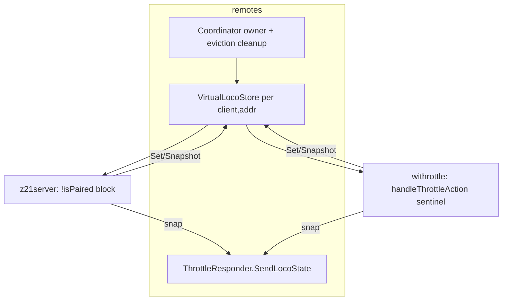
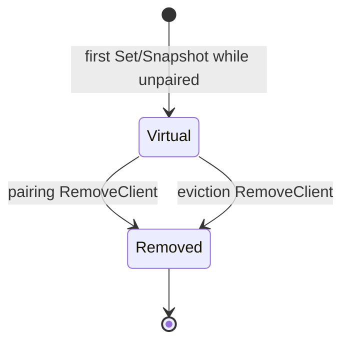

# Implementation plan — virtual locomotive for unpaired Remotes handsets

Give unpaired Z21 and WiThrottle handsets a **working throttle UI during pairing** by
simulating locomotive state in memory (speed, direction, functions) and echoing it back
through the existing `remotes.ThrottleResponder.SendLocoState` path. No DCC commands are
sent until pairing completes.

Related specifications:

- Z21 server plan — [`./z21-server-dcc-bus.md`](./z21-server-dcc-bus.md)
- WiThrottle server plan — [`./withrottle-server.md`](./withrottle-server.md)
- `remotes` layer — `bigfred/pkgs/bigfred/remotes/`
- Z21 protocol — [`../protos/z21.md`](../protos/z21.md)
- WiThrottle protocol — [`../protos/withrottle.md`](../protos/withrottle.md)

---

## Goals and behaviour

While **unpaired**, a handset should see a responsive throttle: turning the speed knob and
pressing function keys update stored state and are echoed immediately to the pilot. State is
held **per (client key, DCC address)** in memory only; the physical layout is untouched.

| Protocol | Virtual loco scope |
|----------|-------------------|
| **Z21** | Any address the pilot selects while unpaired |
| **WiThrottle** | The existing pairing **sentinel** address (`PairingAddr`, default 10239) — the only address an unpaired client may acquire today |

**Function keys do both:** they toggle the simulated function (echo) **and** feed the
existing pairing digit buffer (same decision as Z21-only planning round).

---

## Unified architecture

Both protocols already share outbound encoding via `remotes.ThrottleResponder`:

- Z21 `Responder.SendLocoState` → `LAN_X_LOCO_INFO` (`z21server/adapter.go`)
- WiThrottle `Responder.SendLocoState` → `M…A…V/R/F` lines (`withrottle/adapter.go`, `fanout.go`)

A single protocol-agnostic store produces `contract.LocoStateWire`; each gateway encodes
echo with its existing `Responder`.



---

## Code changes

### 1. Shared store — `bigfred/pkgs/bigfred/remotes/virtualloco.go`

New `VirtualLocoStore` with:

- `Snapshot(clientKey, addr)` — default stopped, forward
- `SetSpeed(clientKey, addr, speed, forward)`
- `SetFunction(clientKey, addr, fn, on)`
- `RemoveClient(clientKey)` — drop all simulated locos for one handset

Internal state: speed `uint8`, forward `bool`, functions `[32]bool` per address.

### 2. Coordinator ownership — `bigfred/pkgs/bigfred/remotes/coordinator.go`

- Field `virtual *VirtualLocoStore`, initialised in `NewCoordinator`
- Accessor `VirtualLocos() *VirtualLocoStore`
- `evictClient` calls `virtual.RemoveClient(key)` after registry removal

### 3. Z21 gateway — `bigfred/pkgs/bigfred/dcc-bus/z21server/server.go`

- Field `virtual *remotes.VirtualLocoStore` from coordinator (or standalone store in tests)
- Helper `sendVirtualLoco(ctx, client, snap)` → `NewResponder(s, client).SendLocoState`
- Replace unpaired block (`!isPaired`) to handle:
  - `LAN_X_GET_LOCO_INFO` → snapshot echo
  - `LAN_X_SET_LOCO_DRIVE` → `SetSpeed` + echo
  - `LAN_X_SET_LOCO_FUNCTION` / `_GROUP` → `SetFunction` + echo, then pairing buffer (F ON)
- Remove today’s silent reject / log-only drive branch

**Cleanup on pairing (Z21):** `virtual.RemoveClient(client.Key)` after successful pairing in:

- `handleUnpairedPairingFn` (function-key path)
- `lan_aux.go` and `progtrack.go` (CV3/CV4 POM paths) when `active != nil`

### 4. WiThrottle gateway — `bigfred/pkgs/bigfred/dcc-bus/withrottle/server.go`

- Field `virtual` wired like Z21
- Helper `sendVirtualLoco(ctx, client, throttleID, snap)`
- Extend `handleThrottleAction` when `!paired && sentinelAcquired`:
  - `V` → `SetSpeed` (DCC encoding via `dccSpeedFromWire`) + echo
  - `R` → update forward, keep speed + echo
  - `F`/`f` → `SetFunction` + echo, then existing pairing rising-edge logic

**Cleanup on pairing (WiThrottle):** `virtual.RemoveClient(clientKey)` in `onPaired`.

---

## Virtual state lifecycle (memory hygiene)

Simulated locos are removed so no stale entries remain:

| Event | Cleanup |
|-------|---------|
| Handset disconnect / idle eviction / logoff | `Coordinator.evictClient` → `RemoveClient` |
| Successful pairing | Z21 pairing completion paths; WiThrottle `onPaired` |



---

## Tests

| Package | Coverage |
|---------|----------|
| `remotes` | `virtualloco_test.go` — defaults, SetSpeed/SetFunction, per-client/addr isolation, RemoveClient |
| `remotes` | Coordinator `Evict` clears virtual store entry |
| `z21server` | Unpaired GET_LOCO_INFO / SET_LOCO_DRIVE / SET_LOCO_FUNCTION echo; pairing still works; no `InboundDrivePort` calls |
| `withrottle` | Sentinel `V`/`R`/`F` echo; pairing unchanged; no drive port calls |

---

## Verification

From `bigfred/`:

```bash
go build ./...
go test ./pkgs/bigfred/remotes/... ./pkgs/bigfred/dcc-bus/z21server/... ./pkgs/bigfred/dcc-bus/withrottle/...
```

Manual:

- **Z21:** Roco WlanMaus — throttle and F-keys respond before pairing completes
- **WiThrottle:** Engine Driver on “Pair with BigFred” sentinel (optional)
