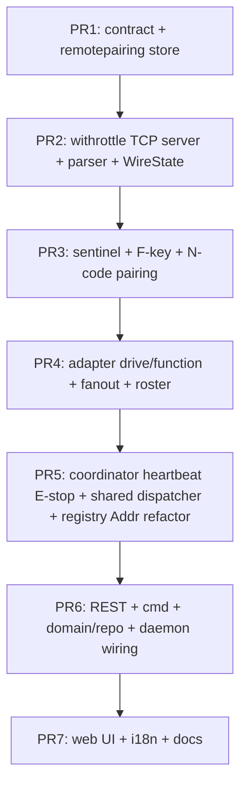

# Implementation plan — WiThrottle server in dcc-bus

Expose an **optional inbound WiThrottle TCP server** inside the `dcc-bus` daemon so
mobile throttle apps (Engine Driver, WiThrottle for iOS) and physical WiThrottle
handsets can drive locomotives through the same command path as the browser
WebSocket throttle and the existing Z21 inbound server. The server reuses the
protocol-agnostic `remotes` layer (Coordinator, inbound ClientRegistry,
remotepairing Store, Gateway factory) introduced by the Z21 work and adds a
WiThrottle protocol adapter alongside `z21server`.

**Pairing model.** Authorization is established with a **6-digit numeric code**
shown in the BigFred UI (e.g. `1 2 2 1 4 5`). The code is entered on the handset
through **one of two equivalent paths**:

1. **Function keys (physical handsets).** BigFred advertises a single sentinel
   "Pair with BigFred" roster entry to unpaired clients. The user acquires it and
   presses function keys `F1`…`F9` (one digit each) or `F10`…`F32` (two digits
   each) in sequence; six digits complete the code. The WiThrottle `HU` device id
   becomes the paired client key. This mirrors the Z21 function-key pairing flow
   verbatim (same fragment-buffer logic).
2. **Device name (touch throttles).** The user sets the Engine Driver **Device
   Name** to the code (`N122145`). On connect, BigFred matches the name against
   in-flight pending requests and pairs immediately. No sentinel acquire needed.

Both paths resolve to the same `PairViaWithrottleCode(code, clientKey)` Redis
call. The store does not know how the code was captured — identical to Z21, where
CV3/CV4 POM writes and function-key sequences both end at `PairViaCV3CV4`.

Related specifications:

- WiThrottle protocol — [`../protos/withrottle.md`](../protos/withrottle.md)
- Z21 server plan — [`./z21-server-dcc-bus.md`](./z21-server-dcc-bus.md)
- dcc-bus overview — [`../architecture/16-dcc-bus/01-overview-and-goals.md`](../architecture/16-dcc-bus/01-overview-and-goals.md)
- dcc-bus authorization — [`../architecture/16-dcc-bus/05-authorization.md`](../architecture/16-dcc-bus/05-authorization.md)
- `remotes` layer — `bigfred/pkgs/bigfred/remotes/`
- `remotepairing` store — `bigfred/pkgs/bigfred/remotepairing/store.go`

---

## Goals and architecture

### Target topology

WiThrottle clients talk TCP to `dcc-bus`, which acts as a **virtual WiThrottle
server** and forwards drive commands to the real driver already owned by the
daemon (`Z21Roco`, LocoNet, …), exactly as the Z21 inbound server does over UDP.

```text
[Engine Driver / WiThrottle handset] ──TCP :12090──► [dcc-bus WiThrottle server]
                                                          │
                                                          ▼
                                                   remotes.Coordinator
                                                          │
                                                          ▼
                                                   cmd.Router (reuse)
                                                          │
                                                          ▼
                                        commandstation.Station ──► [real CS / track]
```

The browser WebSocket throttle, the Z21 inbound server, and the WiThrottle
inbound server all share **one** `cmd.Router` and **one** `remotes.Coordinator`
per `dcc-bus` process. A user may hold **at most one** inbound handset session
per command station across protocols (enforced by the shared
`bigfred:remote:byuser:*` Redis key) — a Z21-paired user cannot simultaneously
hold a WiThrottle session on the same CS.

### Protocol differences driving the design

| Aspect | Z21 (existing) | WiThrottle (this plan) | Implication |
|--------|----------------|------------------------|-------------|
| Transport | UDP, connectionless, binary | **TCP**, connection-oriented, line-oriented ASCII | TCP accept loop + line reader instead of `ReadFromUDP` |
| Client identity | `IP:port` (or IP when sticky) | **`HU<deviceId>`** UUID sent by client | `clientKey = withrottle:<deviceId>`, not endpoint |
| Key stability | IP-sticky opt-in | **stable by nature** (UUID survives WiFi roam) | No IP-stickiness needed; session survives reconnect |
| Registration | implicit (first packet) | **explicit**: `HU` + `N` + `*+` heartbeat | Anonymous window before `HU`; client enters registry only after `HU` |
| Pairing | passive CV3/CV4 POM intercept | **no CV** — code entered in client | Function-key path on a sentinel loco + device-name path |
| Heartbeat | none (idle evict) | **dead-man switch** `*<n>`, E-stop on timeout | `ProtocolPolicy.HeartbeatTimeout` + E-stop before evict |
| Multi-loco | slot dispatch, 1 loco per sub | **MultiThrottle**: many locos per connection | Subscribe many addresses; `*` action = all locos on throttle |
| State push | `LAN_X_LOCO_INFO` | `M<id>A<loco><;>V/F/R/s` | Different wire format, same subscriber-index fanout |

The `remotes` layer is protocol-agnostic; WiThrottle fits without structural
changes. New work is the protocol adapter, a new `PairingStrategy`, a sentinel
roster, and small contract additions.

### Confirmed design decisions

1. **Opt-in via Command Station settings (UI).** Layout owners / admins enable the
   inbound WiThrottle server per command station in the existing Command Station
   create/edit dialog. Persisted as `command_stations.withrottle_server_enabled`
   (default `false`) plus optional `withrottle_port` and `withrottle_pairing_addr`.
   Saving triggers the supervisord rebuild so `dcc-bus` restarts with or without
   `--enable-withrottle`. CLI flags `--enable-withrottle`, `--withrottle-bind`,
   `--withrottle-port`, `--withrottle-heartbeat-secs`, and
   `--withrottle-pairing-addr` are the daemon surface; `loco-server` sets
   `--enable-withrottle` from the DB row when spawning the process.
2. **One pilot per user per CS, shared with Z21.** The shared
   `bigfred:remote:byuser:{layout}:{cs}:{user}` key means a user cannot hold a
   Z21 session and a WiThrottle session on the same CS at the same time.
   `remotepairing.ErrUserAlreadyPaired` is surfaced as `ErrRemoteUserAlreadyPaired`.
3. **Client key is the `HU` device id**, not the TCP endpoint. The TCP remote
   address is updated on reconnect; the session, subscriptions, and Redis active
   key survive reconnect without re-pairing. This is "stickiness for free" and
   strictly better than Z21 IP-stickiness.
4. **Pairing code: 6 digits, 0–9, 5-minute TTL, dedup SET.** Same space budget as
   Z21 CV3/CV4. Two entry paths (function keys, device name) feed the same store
   call. No prefix on the device-name path.
5. **Dead-man switch on heartbeat timeout.** WiThrottle `*<n>` configures
   `ProtocolPolicy.HeartbeatTimeout`. On timeout the coordinator first
   emergency-stops the session's subscribed locos (`ApplyHandsetPilotEStop`),
   then evicts and unpairs. This realizes the existing `TODO(withrottle)` in
   `remotes/coordinator.go`.
6. **Sentinel pairing loco.** Unpaired clients receive a one-entry roster
   `RL1]\[␣Pair with BigFred}|{<sentinel>}|{L`. Acquiring the sentinel is allowed
   without a session and is never forwarded to the command station. Function-key
   presses on the sentinel are intercepted as pairing digits. After pairing the
   sentinel is released and the real roster is emitted.
7. **No turnouts / routes / fast clock / advanced consists in v1.** These are
   out of BigFred scope today; the server ignores `PTA`/`PRA`/`PFT`/`RC*` client
   commands and emits no `PTT`/`PTL`/`PRT`/`PRL`/`RCC`/`RCD`/`PFT` lines. Steal
   (`M…S`) returns `HM` "not supported" (Digitrax-only; BigFred owns slots).
8. **mDNS discovery deferred.** v1 requires manual host:port entry in the app.
   `_withrottle._tcp.local` advertisement is a follow-up.
9. **Roster is the controllable-locomotives list.** The WiThrottle `RL` roster
   sent to a paired client is **not** the full layout roster — it is built from
   the paired session's vehicle scope (`AllowedAddrs` / `VehicleIDs` /
   `AllowAllVehicles`). Engine Driver therefore lists exactly the locomotives the
   user is authorized to drive, by name and DCC address, and the user acquires
   them by tapping the roster entry (no manual address entry). The roster is
   re-emitted whenever the scope changes (REST `PATCH /remotes/session` →
   `PublishSessionSync(scope)` → daemon re-emits `RL`). See
   [Roster — controllable locomotives](#roster--controllable-locomotives).

---

## Component layout

Analogous 1:1 to `z21server`, sitting alongside it under `dcc-bus/`:

```text
dcc-bus/daemon.go
  └─ remotes.NewGateway("withrottle", GatewayConfig{...})
       └─ withrottle.New(cfg) → *Server  (TCP listener, line parser)
            ├─ Registry   = inbound.ClientRegistry (shared with Coordinator)
            ├─ WireState  = withrottle.WireState
            │     per-client: HU deviceId, N name, MultiThrottle loco sets,
            │     heartbeat monitor flag, direction cache, pairing fn buffer,
            │     sentinel acquire state
            ├─ PairingHandler  (matches N<code> and F-key sequence → CompletePairing)
            ├─ Sentinel        (roster entry + acquire/release of pairing loco)
            └─ Adapter         (maps M…A → remotes.InboundDrivePort)
```

`Server` implements `remotes.RemoteProtocol` (`Name()`, `Run(ctx)`,
`OnLocoStateChanged`) and registers through
`remotes.RegisterGatewayFactory(contract.RemoteProtocolWithrottle, NewGateway)` —
exactly like `z21server.GatewayName`.

---

## Client identity and registry

```go
const GatewayName = contract.RemoteProtocolWithrottle // "withrottle"
clientKey := inbound.ClientKey("withrottle", deviceId) // endpoint = HU UUID
```

`inbound.ClientRegistry.Touch` builds the key from the network address. WiThrottle
needs **delayed registration**: the TCP connection is accepted into an anonymous
per-connection goroutine, and the client enters the shared registry only after the
first `HU<id>` line. Until then, `HU` / `N` / `*+` are handled inline (before the
dispatch shard); `M…` commands are ignored for anonymous connections.

On reconnect the same `HU` id maps to the same registry entry; the stored
`net.Addr` is updated to the new remote address. Subscriptions and the Redis
active session survive — no re-pairing needed.

**Refactor:** `inbound.Client.Addr` is currently `net.UDPAddr`. Change it to
`net.Addr` (or add a parallel `TCPAddr` field) so WiThrottle can store the TCP
remote address. This is a minimal, mechanical change; Z21 casts back to
`*net.UDPAddr` for `WriteToUDP`. The subscriber index and `Subscribers(addr)`
are unaffected.

---

## Pairing design

### The protocol constraint

In Z21, function-key pairing works because UDP is stateless: the handset sends
`LAN_X_SET_FUNCTION` for the currently selected loco **without any acquire**,
and BigFred intercepts every function packet in the `!isPaired` branch
(`handleUnpairedPairingFn`). The selected loco address is irrelevant to pairing;
only the function numbers matter.

WiThrottle is connection-oriented and **requires acquire before throttle
actions**: a client cannot send `M0A*<;>F11` until it has acquired a loco on a
MultiThrottle instance (`M0+…`). Engine Driver does not even render the function
panel until a loco is selected. An unpaired client's acquire would be rejected by
`AuthorizeDrive`, so it could never reach a function press. This is the single
protocol difference that drives the sentinel design.

### The sentinel pairing loco

BigFred emits a one-entry roster to unpaired clients:

```text
RL1]\[␣Pair with BigFred}|{<sentinel>}|{L
```

`<sentinel>` is a reserved DCC long address (default `10239`, the max long
address; configurable via `--withrottle-pairing-addr`). The user selects and
acquires the sentinel in the app; BigFred allows the acquire for unpaired
clients **only** at the sentinel address, replies with the standard add/state
dump, and never forwards anything to the command station. Function-key presses
on the sentinel are intercepted as pairing digits. After successful pairing the
sentinel is released (`M0-L<sentinel><;>r`) and the real roster is emitted.

The sentinel is never a real locomotive: no drive/function commands for it reach
the track, and steal prompts are never generated for it (it is always reported
free). Collision with a real layout loco at the same address is harmless for
unpaired clients because nothing is forwarded; after pairing the real roster
replaces the sentinel and the user acquires real addresses through the normal
authorized path.

### Pairing code

- **6 digits, each 0–9.** Same budget as Z21 CV3/CV4 (which encodes two 3-digit
  values in the 111–255 range). 5-minute TTL (`contract.RemotePairingReqTTL`).
- **Function-key encoding (reuse Z21 `pairingDigitsFromFn` verbatim):** `F0`…`F9`
  → one digit (`0`…`9`); `F10`…`F32` → two digits (`10`…`32`). The fragment buffer
  holds up to 6 fragments; concatenation must total exactly 6 digits.
- **Validation:** `ValidWithrottleCode(digits)` = `len == 6` and every char is
  `0`…`9`. Unlike Z21's `parsePairingCodeDigits` there is **no** `ValidPairingCV`
  constraint — any 6 digits are accepted.
- **Redis:** `reqID = "withrottle:122145"`, `dedupLabel = "122145"` in
  `bigfred:remote:reqdedup:{layout}:{cs}:withrottle`, `DisplayLabel = "1 2 2 1 4 5"`
  (spaced for the F-key instruction copy). Generator: `RandomPairingCode` picks 6
  digits 0–9; collision retry against the dedup SET, identical loop to
  `CreateZ21PairingRequest`.

### Pairing paths

Both paths resolve to the same store call
`PairViaWithrottleCode(ctx, layout, cs, code, clientKey, pairedAt)`, which runs
the existing atomic `completePairingScript` (Lua) and returns the evicted prior
clientKey when re-pairing displaces an old session for the same user. The caller
runs `coordinator.Evict(evicted)` to clean up the old client's in-process state —
the same pattern Z21 uses in `PairingHandler.completePairing`.

**Path A — function keys (physical handsets with F buttons):**

```mermaid
sequenceDiagram
  participant U as UI
  participant S as loco-server REST
  participant R as Redis
  participant D as dcc-bus WiThrottle
  participant App as Engine Driver

  U->>S: POST /remotes/withrottle/pairing {vehicleIds}
  S->>R: CreateWithrottlePairingRequest → code "1 2 2 1 4 5"
  S-->>U: {displayLabel, expiresAt, instructions}
  App->>D: TCP connect :12090
  App->>D: HU550e8400-...
  App->>D: NJohn's Throttle
  D-->>App: *10  VN2.0  PPA1  RL1]\[␣Pair with BigFred}|{10239}|{L
  App->>D: *+
  App->>D: M0+L10239<;>L10239
  Note over D: unpaired acquire at sentinel OK; no CS forward
  D-->>App: M0+L10239<;>  M0AL10239<;>F00  V0  R1  s1
  App->>D: M0A*<;>F11
  D->>D: buffer "1"
  App->>D: M0A*<;>F21
  D->>D: buffer "2"
  App->>D: M0A*<;>F21
  App->>D: M0A*<;>F11
  App->>D: M0A*<;>F41
  App->>D: M0A*<;>F51
  D->>D: buffer → "122145" (6 digits)
  D->>R: PairViaWithrottleCode("122145", clientKey=withrottle:550e…)
  R-->>D: active session (+evicted?)
  D->>D: registry.SetPaired; if evicted: coordinator.Evict(evicted)
  D-->>App: M0-L10239<;>r  (release sentinel)
  D-->>App: RL<n>]\[…real roster usera…]  HmPaired as <login>
  App->>D: M0+L341<;>L341  (real loco, normal driving)
```

**Path B — device name (touch throttles):**

```mermaid
sequenceDiagram
  participant U as UI
  participant S as loco-server REST
  participant R as Redis
  participant D as dcc-bus WiThrottle
  participant App as Engine Driver

  U->>S: POST /remotes/withrottle/pairing {vehicleIds}
  S->>R: CreateWithrottlePairingRequest → code "122145"
  S-->>U: {displayLabel, instructions}
  Note over App: User sets Device Name = "122145" in ED settings
  App->>D: TCP connect :12090
  App->>D: HU550e8400-...
  App->>D: N122145
  D->>D: parse N → candidate code "122145"; ValidWithrottleCode OK
  D->>R: PairViaWithrottleCode("122145", clientKey=withrottle:550e…)
  R-->>D: active session (+evicted?)
  D->>D: registry.SetPaired
  D-->>App: *10  VN2.0  PPA1  RL<n>]\[…real roster usera…]  HmPaired as <login>
  App->>D: *+
  App->>D: M0+L341<;>L341  (real loco)
```

### Function-key interception details

- Intercept **rising edges only**: `M<id>A<key><;>F1<fn>` (press, state `1`) and
  `f1<fn>` (force on) count as a digit; `F0<fn>` (release) and `f0<fn>` (force
  off) do not. This mirrors Z21's `pairingFnRisingEdges`.
- The `locoKey` (`*` vs `L10239` vs a specific key) is irrelevant to pairing; only
  the function number is buffered.
- Buffer lives in `WireState` per client, identical shape to Z21's `pairFnBuf`
  and `pairFnPrevGroup`. Clear on successful pairing, on sentinel release, and on
  evict.
- If the concatenated digits exceed 6 without matching, slide the window to the
  last 6 fragments (same `pairingFnBufferSize = 6` trimming as Z21).

### Device-name match details

- On `N<name>` from an unpaired client, strip whitespace and test
  `ValidWithrottleCode(name)`. If valid and the code is currently in the dedup
  SET (in-flight), call `PairViaWithrottleCode`. If the code is not in-flight,
  ignore (the name is a real device name, not a pairing attempt).
- After a successful N-path pairing, subsequent `N122145` lines on the same
  (now paired) client are ignored — the client is already paired, so the match
  logic does not run.
- **Collision risk:** a user whose real device name happens to be exactly 6
  digits and connects during the 5-minute window where that code is in-flight
  would pair as the pending request's user. This is the same threat model as Z21
  CV3/CV4 (someone guessing the code on the same CS). Mitigated by 6-digit space
  (1e6 codes), 5-minute TTL, LAN/trusted-user scope, and the code being shown
  only to the user who started pairing.

### Fallback: admin claim of a connected device

For hardware panels whose device name is not easily editable and whose function
keys are not practical for code entry, an admin can bind an already-connected
unpaired device to a user account:

```mermaid
sequenceDiagram
  participant App as Throttle (hardware panel)
  participant D as dcc-bus
  participant R as Redis
  participant Admin as Admin UI

  App->>D: HU<id>, N<someName>
  D->>R: TouchSeen (unpaired; visible in /remotes/clients)
  Admin->>S: GET /remotes/clients → sees withrottle:<id>, N=<name>
  Admin->>S: POST /remotes/withrottle/claim {clientKey, userId}
  S->>R: CompletePairing(reqID=pre-generated for user, clientKey)
  R-->>S: active
  S->>R: PublishSessionSync(scope)
  D-->>App: real roster + HmPaired
```

`POST /remotes/{protocol}/claim` is admin-only (same gate as `ListClients`). It
reuses `CompletePairing` with a pending req the admin's user already started, or
a server-generated req tied to the target user. **Deferred to a follow-up PR** —
the two primary paths cover Engine Driver and physical F-key handsets.

---

## Coordinator policy and heartbeat dead-man

```go
coordinator.RegisterPolicy(contract.RemoteProtocolWithrottle, remotes.ProtocolPolicy{
    IdleEvict:       120 * time.Second,  // no activity at all (rare; heartbeat normally keeps it fresh)
    StickyIdleEvict: 30 * time.Minute,   // unused (IPStickiness = false)
    IPStickiness:    false,
    HeartbeatTimeout: withrottle.HeartbeatTimeout(cfg.HeartbeatSecs), // *<n> + grace
})
```

`ProtocolPolicy.HeartbeatTimeout` already exists with a `TODO(withrottle)` in
`remotes/coordinator.go`. This plan implements it:

- In `Coordinator.sweep`, for a client whose `idle >= policy.HeartbeatTimeout`
  and whose session is non-nil, first call
  `ApplyHandsetPilotEStop(ctx, session, addr)` for every subscribed loco, then
  `evictClient` (which unpairs in Redis and runs `onEvict` hooks).
- Z21 leaves `HeartbeatTimeout` zero and is unaffected.
- The heartbeat grace window is `*<n>` seconds configured by the client plus a
  small slack (e.g. `n + 5s`) to absorb jitter, matching the WiThrottle spec
  ("server may E-stop controlled locos" §6.2).

`HandsetDrivePort.ApplyHandsetPilotEStop` already exists; no new port method is
needed.

---

## TCP server loop and line parser

```go
func (s *Server) Run(ctx context.Context) error {
    ln, err := net.Listen("tcp", net.JoinHostPort(s.cfg.Bind, strconv.Itoa(int(s.cfg.Port))))
    if err != nil { return err }
    defer ln.Close()
    for {
        conn, err := ln.Accept()
        if err != nil { if ctx.Err() != nil { return nil }; continue }
        go s.serveConn(ctx, conn)
    }
}

func (s *Server) serveConn(ctx context.Context, conn net.Conn) {
    r := bufio.NewReaderSize(conn, 512)
    defer conn.Close()
    var clientKey string // empty until HU arrives
    for {
        line, err := r.ReadString('\n')
        if err != nil { s.handleDisconnect(clientKey); return }
        line = strings.TrimRight(line, "\r\n")
        if line == "" { continue } // spec §2.2: ignore duplicate empty lines
        // HU / N / *+ handled inline before dispatch (anonymous window)
        if clientKey == "" {
            if handled, key := s.handleAnonymous(ctx, conn, line); handled {
                if key != "" { clientKey = key }
                continue
            }
            continue // ignore M… until registered
        }
        key := clientKey
        s.dispatch.dispatch(key, func() { s.handleLine(ctx, conn, key, line) })
    }
}
```

Line termination accepts LF, CR, or CRLF (spec §2.2). The dispatcher reuses the
shard-per-client pattern from `z21server/dispatcher.go` (FNV-1a hash, buffered
queues, inline fallback on saturation, `InlineFallbacks` counter). The dispatcher
is extracted to `remotes/inbound/dispatcher.go` and shared by `z21server` and
`withrottle` to remove the duplication.

Parser structure (spec §18.1):

1. Longest-prefix match: `HU`, `N`, `*`, `Q`, `PPA`, `PTA`, `PRA`, `RC`, `M`, `VN`,
   `HM`/`Hm`, `HT`/`Ht`, `PW`, `PFT`, `PTT`, `PTL`, `PRT`, `PRL`, `RCC`, `RCD`.
2. For `M` messages, branch on `line[1]` (throttle id) and `line[2]`
   (`+`/`-`/`S`/`A`/`L`).
3. Split remaining fields on `<;>`; parse the action letter (`V`/`F`/`f`/`R`/`s`/…).
4. Unknown lines are ignored (spec §16.3).

---

## Drive mapping (Adapter)

`withrottle/adapter.go` maps parsed WiThrottle commands to
`remotes.InboundDrivePort`. `ThrottleActor.SessionID = remotes.HandsetSessionID(clientKey)`,
identical to Z21.

| WiThrottle in | Action | `contract` output |
|---------------|--------|-------------------|
| `M0+S3<;>S3` | acquire short | `AuthorizeDrive` + `Subscribe([3])` + state dump |
| `M0+L341<;>ED&RGW 341` | acquire by roster id | resolve roster → addr, then as above |
| `M0-*<;>r` / `M0-S3<;>r` | release | unsubscribe; idle-brake if session ends |
| `M0A*<;>V30` | speed (all locos on throttle) | `LocoSetSpeedWire` per subscribed loco, direction from cache |
| `M0AS3<;>V30` | speed (one loco) | `LocoSetSpeedWire{Address:3,…}` |
| `M0A*<;>R1` | direction | cache direction in `WireState`; apply on next `V` |
| `M0A*<;>F112` / `f112` | function press / force on | `LocoSetFunctionWire{Function:12, On:true}` |
| `M0A*<;>F012` / `f012` | function release / force off | `LocoSetFunctionWire{Function:12, On:false}` |
| `M0A*<;>X` | emergency stop | `ApplyHandsetPilotEStop` per subscribed loco |
| `M0A*<;>I` | idle (stop) | `LocoSetSpeedWire{Speed:0}` |
| `M0A*<;>qV` / `qR` | query speed / direction | re-emit `V`/`R` from `LocoStateWire` |
| `M0A*<;>s1` | speed-step mode | record in `WireState` (informational) |
| `M0A*<;>E<rosterId>` | select from roster | resolve roster id → addr |
| `PPA1` / `PPA0` | track power | power port (if exposed); else `HM` "not supported" |
| `*` / `*+` / `*-` | heartbeat | update lastSeen + monitor flag in `WireState` |
| `Q` | quit | `coordinator.Evict` (release throttles, unpair) |

**Scope enforcement:** every `M…+` and `M…A<addr>` checks
`AuthorizeDrive(userID, addr, DriveScope)`. Addresses outside
`AllowedAddrs`/`AllowAllVehicles` are rejected with an `HM…` alert (spec §16.1)
and no `M…+` confirmation reply. The roster emitted to the client only contains
allowed addresses, so a well-behaved client never attempts an unauthorized
acquire.

**Speed encoding:** WiThrottle speed 0 = stop, 1 = emergency stop, 2…126 = speed
(spec §9.2). Map `1` to an emergency stop (`ApplyHandsetPilotEStop`), `0` to
speed 0, `2…126` to the 128-step DCC speed. Negative `V` values sent during
acquisition (JMRI quirk) are treated as E-stop.

**MultiThrottle:** each `M<id>` instance keeps its own loco set in `WireState`.
`locoKey = *` applies the action to every loco on that instance; a specific
`S/L` key applies to one. Subscribe/unsubscribe updates the shared
`inbound.ClientRegistry` subscriber index so state fanout is O(subscribers).

---

## State fanout

`withrottle/fanout.go` implements `OnLocoStateChanged`, mirroring `z21server/fanout.go`
but with WiThrottle wire format:

```go
func (s *Server) OnLocoStateChanged(ctx context.Context, snap contract.LocoStateWire) {
    if s.registry == nil { return }
    for _, key := range s.registry.Subscribers(snap.Address) {
        c, ok := s.registry.Get(key)
        if !ok || c.Session == nil { continue }
        s.writeLine(&c.Addr, key, buildLocoNotify(c, snap, s.cfg.SpeedSteps))
    }
}
```

`buildLocoNotify` emits one or more `M<id>A<locoKey><;>…` lines per subscribed
client for the changed loco:

- `M<id>A<locoKey><;>V<speed>` (0…126; E-stop = 1)
- `M<id>A<locoKey><;>R<dir>` (0 reverse, 1 forward)
- `M<id>A<locoKey><;>F<state><fn>` per changed function (state 0/1)
- `M<id>A<locoKey><;>s<mode>` when speed-step mode changes

`<id>` and `<locoKey>` are read from the client's `WireState` MultiThrottle
table (the loco was acquired on a specific throttle instance). The subscriber
index from `inbound.ClientRegistry` is O(subscribers) per state change — no
deep copy of every client, identical to the Z21 optimization.

`writeLine` writes one line terminated by `\n` to the client's TCP connection.
Writes for one client are serialized through the dispatch shard (same shard
that reads), so reads and writes for one client do not race on the conn.

---

## Initial burst and roster

After a successful pairing (or an unpaired connect, for the sentinel roster) the
server sends the initial burst (spec §5), one line per topic:

- `VN2.0` — protocol version (Engine Driver requires ≥ 2.0).
- `*<heartbeatSecs>` — heartbeat timeout. `0` disables the dead-man; BigFred
  advertises the configured `--withrottle-heartbeat-secs` (default 10).
- `PPA<0|1|2>` — track power from the shared system state (same source as Z21).
- `RL<n>]\[…]|{addr}|{S|L` — roster (see [Roster — controllable
  locomotives](#roster--controllable-locomotives)).
- `HTBigFred` / `HtBigFred <layoutName>` — server identity (spec §16.2).
- `HM`/`Hm` — pairing result info (`HmPaired as <login>` / `HmPairing failed`).

Deferred (not emitted in v1): `PTT`/`PTL` (turnouts), `PRT`/`PRL` (routes),
`RCC`/`RCD` (consists), `PFT` (fast clock), `PW` (web port). Clients must ignore
missing topics (spec §16.3).

Function labels `M<id>L<loco><;>]\[…` (spec §10.2) are emitted after acquire with
generic `F0`…`F28` placeholder labels in v1; named labels from the roster are a
follow-up.

---

## Roster — controllable locomotives

The WiThrottle roster (`RL`) is BigFred's vehicle for telling a client **which
locomotives it may drive**. It is not a dump of every locomotive on the layout;
it is derived from the paired session's authorization scope, so the app's roster
screen doubles as the access-control surface — a user only ever sees locomotives
they are allowed to drive, and acquires one by tapping it rather than typing a
DCC address.

### Source

The roster is built from the active session's `VehicleIDs` / `AllowedAddrs`
(resolved at pairing time from the layout roster + `DrivePolicy`, the same
`resolvePairingScope` path used by Z21). A `RosterProvider` port is passed to the
gateway through `GatewayConfig.Extra["rosterProvider"]` and resolves each vehicle
id to `{name, dccAddr, short|long}` from the layout roster (`LayoutRoster`).

```go
type RosterProvider interface {
    VehiclesForSession(ctx context.Context, layoutID uint, sess contract.RemoteSessionWire) ([]RosterEntry, error)
}

type RosterEntry struct {
    Name     string // layout roster display name
    Addr     uint16
    IsLong   bool   // S vs L prefix
    RosterID string // optional, for E<id> acquire-by-name
}
```

### Wire format

```text
RL<n>]\[<name>}|{<addr>}|{S|L]\[<name2>}|{<addr2>}|{S|L…
```

`n` matches the entry count (spec §5.2). Each entry's third field is `S` (short,
1–127) or `L` (long, 128–10239). Duplicate DCC addresses are emitted once (a
vehicle and a train sharing an address appear as one drivable entry).

### Per-session states

| Client state | Roster emitted |
|--------------|----------------|
| Unpaired (anonymous window, after `HU`) | `RL1]\[␣Pair with BigFred}|{<sentinel>}|{L` — the sentinel only, so the user can pair via function keys (see [Pairing design](#pairing-design)). |
| Paired, `AllowAllVehicles = false` | `RL<n>]\[…` with one entry per allowed vehicle. |
| Paired, `AllowAllVehicles = true` | `RL0` (empty roster) — the user may acquire **any** address by typing it in the app's "add loco by address" field. The app still works; BigFred authorizes at acquire time via `AuthorizeDrive`. |

When `AllowAllVehicles` is true, an empty `RL0` is the honest signal: there is no
fixed list, the client enters an address manually. (Some clients render `RL0` as
"no roster"; Engine Driver still allows manual address entry, which is the
intended path for the all-vehicles mode.)

### Acquire from the roster

A paired client acquires a roster entry in two equivalent ways (spec §8.1):

- By address: `M0+L341<;>L341`
- By roster entry id: `M0+L341<;>ED&RGW 341`

BigFred accepts both. Either way `AuthorizeDrive(userID, addr, DriveScope)` gates
the acquire; because the roster only contains authorized addresses, a
well-behaved client never trips the gate. A manually-entered address (all-vehicles
mode, or a user typing an out-of-scope address) that fails `AuthorizeDrive` is
rejected with `HM` and no `M0+…<;>` confirmation.

### Live updates

The roster reflects the **current** session scope. When scope changes out of band
(REST `PATCH /remotes/session`), the server re-emits `RL` to the affected client
so the app's roster screen updates without a reconnect:

```text
PATCH /remotes/session {vehicleIds:[…]}
  → remotepairing.UpdateSessionScope (atomic, preserves TTL)
  → PublishSessionSync(clientKey, "scope")
  → coordinator session-sync subscriber re-syncs the in-process session
  → withrottle server detects scope change → writes RL<n>]\[…new roster…] to the conn
```

Conversely, when a vehicle the user is currently driving is **removed** from
their scope, the server releases it on the client's behalf (`M0-<key><;>r`) before
re-emitting the shorter roster, so the app does not show a stale "acquired" loco
that BigFred no longer authorizes.

### Sentinels and the roster

The pairing sentinel is **only** emitted to unpaired clients. The moment pairing
completes, the server releases the sentinel (`M0-L<sentinel><;>r`) and emits the
real roster in the same burst, so the user transitions directly from "Pair with
BigFred" to their authorized locomotive list without re-connecting.

---

## Redis keys and contract additions

All existing `bigfred:remote:*` keys are reused unchanged (the store is
protocol-agnostic). Only additions:

`contract/remote.go`:
```go
const RemoteProtocolWithrottle = "withrottle"
```

`contract/withrottlepairing.go` (new, mirrors `z21pairing.go`):
```go
func WithrottlePairReqID(code string) string        // "withrottle:122145"
func WithrottlePairLabel(code string) string        // "122145" (dedup SET member)
func WithrottlePairingDisplayLabel(code string) string // "1 2 2 1 4 5"
func RandomPairingCode(rng *rand.Rand) string       // 6 digits 0-9
func ValidWithrottleCode(code string) bool          // len==6, all digits 0-9
```

`contract.RemotePendingWire` / `RemoteSessionWire` — new optional field:
```go
PairingCode string `json:"pairingCode,omitempty"` // WiThrottle (Z21 keeps using PairingCV3/CV4)
```

`remotepairing/store.go` — new methods mirroring the Z21 pair:
```go
func (s *Store) CreateWithrottlePairingRequest(ctx, in CreateWithrottlePairingInput) (contract.RemotePendingWire, error)
func (s *Store) PairViaWithrottleCode(ctx, layout, cs uint, code, clientKey string, pairedAt int64) (contract.RemoteSessionWire, bool, string, error)
```

`CreateWithrottlePairingRequest` is structurally identical to
`CreateZ21PairingRequest` — `rejectIfUserPaired`, `clearUserPending`, dedup SET
loop with `RandomPairingCode`, `RemotePairingReqTTL`, `dedupTTLSlack` — minus the
CV3/CV4 fields. `PairViaWithrottleCode` calls `CompletePairing` with
`reqID = WithrottlePairReqID(code)` and `dedupLabel = WithrottlePairLabel(code)`,
returning the evicted prior clientKey exactly like `PairViaCV3CV4`.

`remotes/protocol.go` — realize the existing `TODO(withrottle)`:
```go
type WithrottlePairingStrategy struct{ store *remotepairing.Store }
func (s WithrottlePairingStrategy) Protocol() string { return contract.RemoteProtocolWithrottle }
func (s WithrottlePairingStrategy) CreatePending(ctx, store, in CreatePendingParams) (contract.RemotePendingWire, error)
```
`cmd.Remote.StartPairing` is routed through registered strategies instead of the
manual `switch protocol`, removing the TODO. Z21 keeps working via
`Z21PairingStrategy`.

---

## REST API and server cmd

No new routes — the existing `/remotes/*` surface is protocol-parameterized:

| Route | Behavior for WiThrottle |
|-------|--------------------------|
| `GET /remotes/status` | Returns paired/pending state for the user on the CS; `protocol = "withrottle"` when paired or pending. |
| `GET /remotes/clients` | Admin-only; lists every connected handset including `withrottle:<deviceId>` clients (already protocol-agnostic). |
| `POST /remotes/{protocol}/pairing` | `protocol = "withrottle"` → `CreateWithrottlePairingRequest`; returns `{displayLabel, pairingCode, expiresAt, instructions}`. |
| `DELETE /remotes/pairing` | Cancels the user's pending code (protocol-agnostic). |
| `PATCH /remotes/session` | Updates vehicle scope on the active session; `PublishSessionSync(scope)`. |
| `DELETE /remotes/session` | Unpairs; `PublishSessionSync(unpair)`. |

`server/cmd/withrottle_remote.go` (new) is a structural clone of
`z21_remote.go`: `StartPairing`, `GetStatus`, `CancelPairing`, `UpdateSession`,
`Unpair`, `ListClients` (shared via `GetClientsSnapshot`), `ensureReady`
(checks `cs.WithrottleServerEnabled`). `server/cmd/remote.go` gets a
`withrottle *WithrottleRemote` delegate (or, after the strategy refactor, a
single generic path). `server/protocol/remote.go::ToRemotePairingResponse` adds:

```go
if req.Protocol == contract.RemoteProtocolWithrottle {
    out.PairingCode = req.PairingCode
    out.Instructions = "Set Engine Driver Device Name to the code, or acquire 'Pair with BigFred' and press the function keys shown."
}
```

`server/errors/remote.go` — reuse `ErrRemoteProtocolUnknown`,
`ErrRemoteUserAlreadyPaired`, `ErrRemoteSessionNotFound`; add
`ErrWithrottleServerDisabled`, `ErrWithrottlePairingScopeInvalid` if not already
covered by the generic remote errors.

`server/domain.CommandStation` — new fields `WithrottleServerEnabled bool`,
`WithrottlePort uint16`, `WithrottlePairingAddr uint16` (default 10239). DB
migration adds the columns; `loco-server` reads them and sets `--enable-withrottle`
etc. when spawning `dcc-bus`.

`server/service/dcc_bus_consumer.go` — `remote.clients.changed` WebSocket event
is already admin-only and protocol-agnostic; no change.

---

## Daemon wiring

`dcc-bus/daemon.go` gains a block parallel to `if d.cfg.EnableZ21`:

```go
if d.cfg.EnableWithrottle {
    remotes.RegisterGatewayFactory(withrottle.GatewayName, withrottle.NewGateway)
    // Share the same pairStore and coordinator as Z21 (one per CS).
    coordinator.RegisterPolicy(contract.RemoteProtocolWithrottle, remotes.ProtocolPolicy{
        IdleEvict:        120 * time.Second,
        IPStickiness:     false,
        HeartbeatTimeout: withrottle.HeartbeatTimeout(d.cfg.WithrottleHeartbeatSecs),
    })
    gw, err := remotes.NewGateway(ctx, withrottle.GatewayName, remotes.GatewayConfig{
        LayoutID:         d.cfg.LayoutID,
        CommandStationID: d.cfg.CommandStationID,
        Coordinator:      coordinator,
        Store:            pairStore,
        Drive:            d.router,
        Log:              d.log,
        Extra: map[string]any{
            "bind":           d.cfg.WithrottleBind,
            "port":           d.cfg.WithrottlePort,
            "heartbeatSecs":  d.cfg.WithrottleHeartbeatSecs,
            "pairingAddr":    d.cfg.WithrottlePairingAddr,
            "speedSteps":     d.cfg.CommandStation.EffectiveSpeedSteps(),
            "rosterProvider": d.router, // for RL from AllowedVehicles
        },
    })
    if err != nil { return fmt.Errorf("withrottle gateway: %w", err) }
    d.router.RegisterLocoObserver(gw)
    go func() {
        if err := gw.Run(ctx); err != nil && ctx.Err() == nil {
            d.log.WithError(err).Error("withrottle inbound server stopped")
            _ = d.redis.Publish(ctx, "daemon.degraded", map[string]any{
                "layoutId": d.cfg.LayoutID, "commandStationId": d.cfg.CommandStationID,
                "reason": "withrottle_bind_failed", "error": err.Error(),
                "at": time.Now().UTC().UnixMilli(),
            })
        }
    }()
}
```

`Config` gains: `EnableWithrottle bool`, `WithrottleBind string`,
`WithrottlePort uint16` (default 12090), `WithrottleHeartbeatSecs float64`
(default 10), `WithrottlePairingAddr uint16` (default 10239). The CLI flags are
parsed in the `dcc-bus` cobra subcommand and forwarded by `loco-server` from the
DB row, exactly as `--enable-z21` is today.

If both `EnableZ21` and `EnableWithrottle` are on, they share the single
`coordinator` and `pairStore`; the one-pilot-per-user rule is enforced by the
shared `bigfred:remote:byuser:*` key.

---

## Files

### New (bigfred)

- `pkgs/bigfred/contract/withrottlepairing.go` — code generator, validators, reqID/label helpers.
- `pkgs/bigfred/dcc-bus/withrottle/server.go` — TCP listener, `Run`, `serveConn`, `handleAnonymous`, `handleLine`.
- `pkgs/bigfred/dcc-bus/withrottle/dispatcher.go` — (or shared `remotes/inbound/dispatcher.go`).
- `pkgs/bigfred/dcc-bus/withrottle/wire_state.go` — per-client HU id, N name, MultiThrottle loco sets, heartbeat flag, direction cache, pairing fn buffer, sentinel state.
- `pkgs/bigfred/dcc-bus/withrottle/pairing.go` — `PairingHandler` (N-match + F-key completion).
- `pkgs/bigfred/dcc-bus/withrottle/pairing_fn.go` — clone of `z21server/pairing_fn.go` with `ValidWithrottleCode` validation.
- `pkgs/bigfred/dcc-bus/withrottle/sentinel.go` — sentinel roster entry, acquire/release, no-CS-forward.
- `pkgs/bigfred/dcc-bus/withrottle/adapter.go` — `M…A` → `InboundDrivePort`; `Responder` (ThrottleResponder).
- `pkgs/bigfred/dcc-bus/withrottle/fanout.go` — `OnLocoStateChanged`, `buildLocoNotify`.
- `pkgs/bigfred/dcc-bus/withrottle/roster.go` — build `RL` from session scope / sentinel.
- `pkgs/bigfred/dcc-bus/withrottle/line.go` — framing helpers (`<;>`, `]\[`, `}|{`), prefix dispatch.
- `pkgs/bigfred/dcc-bus/withrottle/*_test.go` — parser, pairing (F-key + N), sentinel, drive, fanout, heartbeat.
- `pkgs/bigfred/server/cmd/withrottle_remote.go` — service delegate.
- `pkgs/bigfred/server/errors/withrottle.go` (or extend `remote.go`).
- `web/src/api/remotes.ts` — `pairingCode` branch (likely already protocol-agnostic; minor).
- `web/src/pages/remotes/WithrottleRemotePage.tsx` — analog of `Z21RemotePage`.

### Modified (bigfred)

- `pkgs/bigfred/contract/remote.go` — `RemoteProtocolWithrottle`, `PairingCode` field.
- `pkgs/bigfred/remotepairing/store.go` — `CreateWithrottlePairingRequest`, `PairViaWithrottleCode`, `CreateWithrottlePairingInput`.
- `pkgs/bigfred/remotes/protocol.go` — `WithrottlePairingStrategy` (closes TODO).
- `pkgs/bigfred/remotes/coordinator.go` — heartbeat E-stop before evict (closes TODO).
- `pkgs/bigfred/remotes/inbound/registry.go` — `Addr` → `net.Addr` (or add `TCPAddr`).
- `pkgs/bigfred/remotes/inbound/dispatcher.go` — extracted from `z21server`, shared.
- `pkgs/bigfred/dcc-bus/daemon.go` — `EnableWithrottle` block + `Config` fields.
- `pkgs/bigfred/dcc-bus/z21server/server.go` — use shared dispatcher; cast `Addr` to `*net.UDPAddr`.
- `pkgs/bigfred/server/cmd/remote.go` — `withrottle` delegate / strategy routing.
- `pkgs/bigfred/server/protocol/remote.go` — `PairingCode` in pairing response.
- `pkgs/bigfred/server/domain.CommandStation` — `WithrottleServerEnabled`, `WithrottlePort`, `WithrottlePairingAddr`.
- `pkgs/bigfred/server/repo` — DB migration for the new columns.
- `pkgs/bigfred/server/cli/root.go` — `--enable-withrottle` and friends; role resolver unaffected.
- `web/src/i18n/locales/*/errors.json` — new error codes.

### Docs

- `docs/content/en/specs/bigfred/protos/withrottle.md` §19 — replace "BigFred does not implement" with status + link to this plan.
- This plan file.

---

## Test plan

| Area | Cases |
|------|-------|
| Pairing code generation | `RandomPairingCode` length/digits; dedup collision retry; TTL expiry |
| F-key buffering | F1…F9 one digit; F10…F32 two digits; window slide at 7 presses; release edges ignored; `f1`/`f0` force on/off |
| F-key completion | 6 digits → `PairViaWithrottleCode` → active session; wrong code → no pair, buffer cleared on sentinel release |
| N-code path | `N122145` matches in-flight code; non-digit name ignored; 6-digit name with no in-flight code ignored; already-paired client ignores `N` |
| Sentinel | unpaired acquire at sentinel allowed + no CS forward; acquire at non-sentinel rejected for unpaired; release after pairing; roster swap |
| Roster | paired `AllowAllVehicles=false` → `RL<n>` lists exactly allowed vehicles with names+addr+S/L; `AllowAllVehicles=true` → `RL0`; unpaired → sentinel only; duplicate addr deduped; acquire by `L<addr>` and by `E<rosterId>` both work; `PATCH /remotes/session` re-emits `RL`; removed-in-scope loco auto-released before re-emit |
| Scope enforcement | acquire/speed/function outside `AllowedAddrs` → `HM` + no confirm; `AllowAllVehicles` allows any |
| Drive mapping | `V0/1/2…126` → stop/estop/speed; `R0/R1` direction cache; `F/f` press/release; `X` estop; `qV/qR` query |
| MultiThrottle | `M0` and `M1` independent loco sets; `*` applies to all on instance; per-instance subscription |
| Heartbeat | `*+` enables monitor; no `*` for `n+grace` → E-stop subscribed locos then evict; `*-` disables monitor; activity resets watchdog |
| Reconnect | same `HU` after TCP drop → same clientKey, same session, updated addr, no re-pair |
| One pilot per CS | Z21-paired user starting WiThrottle pairing → `ErrUserAlreadyPaired`; re-pair evicts old session |
| Session sync | REST `Unpair`/`UpdateSession` → `PublishSessionSync` → daemon re-syncs in-process state |
| Fanout | loco state change → only subscribed paired clients receive `M…A…` lines; correct `<id>`/`<locoKey>` |
| Restart | `dcc-bus` reloads active sessions from Redis; coordinator sweep resumes |
| Regression | WebSocket throttle + Z21 UDP + WiThrottle TCP on same loco via shared `Router` |
| Line parsing | LF/CR/CRLF termination; empty lines ignored; unknown prefixes ignored; `AT+CIPSENDBUF=` noise stripped (LNWI) |

---

## Pull request sequence



| PR | Scope | Risk |
|----|-------|------|
| 1 | `contract/withrottlepairing.go`, `CreateWithrottlePairingRequest`, `PairViaWithrottleCode`, store tests | Low |
| 2 | TCP listen, line parser, `WireState`, `serveConn`, anonymous window | Medium |
| 3 | Sentinel roster/acquire, F-key intercept, N-code match, `CompletePairing` wiring | Medium |
| 4 | `Adapter` drive/function, `Responder`, `OnLocoStateChanged`, `RL` roster | Medium |
| 5 | Coordinator heartbeat E-stop, extract shared dispatcher, `inbound.Client.Addr` refactor | Medium |
| 6 | `WithrottleRemote` service, `Remote` delegate/strategies, domain + DB migration, daemon `EnableWithrottle` | Low–Medium |
| 7 | `WithrottleRemotePage`, `remotes.ts`, i18n, §19 protos update, user docs | Low |

---

## Risks and mitigations

| Risk | Mitigation |
|------|------------|
| Sentinel address collides with a real loco | Default 10239 (max long); configurable; unpaired sentinel acquire never forwarded; real roster replaces sentinel after pairing |
| F0 (headlight) auto-toggle breaks digit entry | `F0` still maps to digit `0` (matches Z21); instructions tell the user to use `F1`…`F9`; `F0` latching does not corrupt the buffer because only rising edges count |
| N-code collision with a real 6-digit device name | 6-digit space (1e6), 5-min TTL, LAN trust; match only when code is in the dedup SET (in-flight); ignore `N` for already-paired clients |
| Engine Driver requires acquire before function panel | Sentinel roster provides an acquirable entry; acquire is allowed for unpaired clients at the sentinel only |
| TCP read/write race on one conn | Reads and writes for one client run on the same dispatch shard (serialized) |
| Slow client stalls others | Shard-per-client dispatcher with inline fallback (same as Z21); `InlineFallbacks` metric |
| Port 12090 clash with RB1110 WiThrottle | BigFred and RB1110 are separate consumers (spec §19); document that BigFred WiThrottle is for BigFred-owned CS only, or bind a different port |
| One-pilot-per-CS blocks mixed-protocol use | By design (shared `byuser` key); surfaced as `ErrRemoteUserAlreadyPaired`; user unpairs one before pairing the other |
| Heartbeat E-stop fires on slow phone | Grace = `n + slack`; `*-` disables monitor; `*0` advertised if dead-man disabled |
| Full WiThrottle feature surface | Explicit unsupported list (turnouts/routes/fast clock/consists/steal/raw DCC); ignore unknown lines (spec §16.3) |

---

## Definition of Done

- [ ] Command Station settings UI exposes a **WiThrottle server** toggle (and
      optional port / pairing address); values persist and drive
      `--enable-withrottle` via supervisord rebuild.
- [ ] `dcc-bus --enable-withrottle` listens on TCP (default `:12090`) and answers
      the WiThrottle initial burst (`VN2.0`, `*<n>`, `PPA`, `RL`).
- [ ] UI-generated **6-digit code** (TTL 5 min) pairs a client via either:
      - function keys on the sentinel "Pair with BigFred" loco, or
      - Engine Driver Device Name equal to the code.
- [ ] Redis session keyed by `withrottle:<HU deviceId>` with configurable vehicle
      scope; survives TCP reconnect without re-pairing.
- [ ] Unpaired clients cannot drive; paired clients respect vehicle scope +
      roster `DrivePolicy`; out-of-scope actions return `HM` and are not forwarded.
- [ ] Sentinel acquire is never forwarded to the command station.
- [ ] Heartbeat timeout (`*<n>` + grace) emergency-stops subscribed locos, then
      evicts and unpairs.
- [ ] `Q` and TCP close release throttles and unpair.
- [ ] Paired clients reuse the same `cmd.Router` handlers as WebSocket and Z21.
- [ ] Loco state changes fan out to subscribed paired WiThrottle clients as
      `M<id>A<loco><;>V/F/R/s` lines.
- [ ] **Roster** sent to a paired client lists exactly the locomotives its
      session scope allows (by name + DCC address + S/L); `AllowAllVehicles`
      yields `RL0` and manual address entry; the roster re-emits on
      `PATCH /remotes/session` and on pairing (sentinel → real roster).
- [ ] One pilot per user per CS across Z21 and WiThrottle (shared `byuser` key).
- [ ] `go vet ./...`, `go test -race` (remotes, remotepairing, contract,
      dcc-bus/withrottle, server/*), `npm run lint && build` all green.
- [ ] User documentation covers Command Station settings, `/remotes/withrottle`,
      Engine Driver host:port setup, both pairing paths, heartbeat keepalive, and
      the unsupported feature list.
