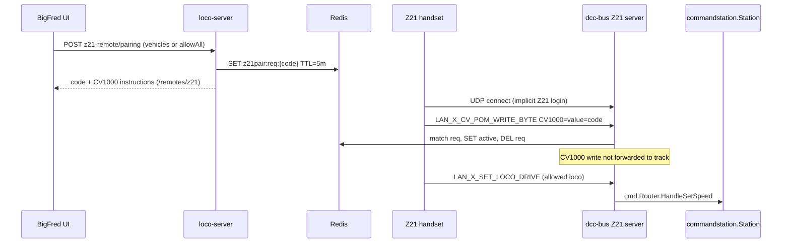
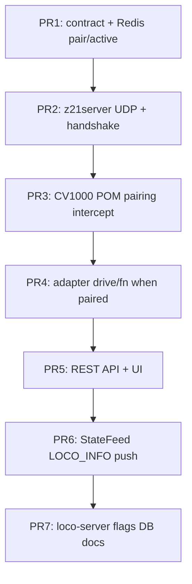

# Implementation plan — Z21 server in dcc-bus

Expose an **optional inbound Z21 LAN UDP server** inside the `dcc-bus` daemon so
physical handsets (Roco Z21 app, Z21 handheld, etc.) can drive locomotives through
the same command path as the browser WebSocket throttle. The server reuses
`cmd.Router` handlers (`HandleSetSpeed`, `HandleSetFunction`, `HandleSubscribe`,
…). It does **not** implement the WebSocket dead-man switch or ping keepalive.

**Pairing model.** Authorization is established when a handset sends a
**Programming-on-the-Main (POM) byte write to CV1000** with a value equal to a
short-lived code generated in the BigFred UI. The **source UDP endpoint**
(`IP + source port`) of that packet is stored in Redis as the paired Z21 session.
No web-UI “confirm pending connection” step is required.

Related specifications:

- Z21 LAN protocol — [`../protos/z21.md`](../protos/z21.md)
- dcc-bus overview — [`../architecture/16-dcc-bus/01-overview-and-goals.md`](../architecture/16-dcc-bus/01-overview-and-goals.md)
- dcc-bus authorization — [`../architecture/16-dcc-bus/05-authorization.md`](../architecture/16-dcc-bus/05-authorization.md)
- Drive roster contract — `bigfred/pkgs/bigfred/contract/allowedvehicles.go`

---

## Goals and architecture

### Target topology

Physical controllers talk UDP to `dcc-bus`, which acts as a **virtual Z21 command
station** and forwards drive commands to the real driver already owned by the
daemon (`Z21Roco`, LocoNet, …).

```text
[Z21 handset] ──UDP :21105──► [dcc-bus Z21 server]
                                    │
                                    ▼
                             cmd.Router (reuse)
                                    │
                                    ▼
                      commandstation.Station ──► [real command station / track]
```

The browser WebSocket throttle and the Z21 server share **one** `cmd.Router`
instance per `dcc-bus` process.

### Confirmed design decisions

1. **Opt-in via Command Station settings (UI).** Layout owners / admins enable the
   inbound Z21 server per command station in the existing **Command Station**
   create/edit dialog (`CommandStationsPage`). The field is persisted as
   `command_stations.z21_server_enabled` (default `false`). Saving triggers the
   usual supervisord rebuild so `dcc-bus` restarts with or without
   `--enable-z21`. CLI flags `--enable-z21`, `--z21-bind`, and `--z21-port`
   remain the daemon surface; `loco-server` sets `--enable-z21` from the DB row
   when spawning the process. Optional advanced fields (`z21_bind`, `z21_port`)
   can live on the same form later; MVP uses daemon defaults (`0.0.0.0:21105`).
2. **No dead-man / no session estop for Z21.** Z21 clients never run
   `watchDeadman`. Timeouts only drop pairing state — **without** calling
   `HandleSessionClose` or layout estop (see decision §11 for the 60-minute
   movement rule).
3. **Pairing via CV1000 POM write.** A handset must write **CV1000** (wire
   address **999**, 0-based per Z21 spec) to the generated code. The write is
   **intercepted** and **never** forwarded to the track.
4. **Session identity = UDP source endpoint.** `clientKey = "<ip>:<port>"` (source
   port of the datagram that carried the pairing write). Loco address inside the
   POM packet is **ignored** for pairing.
5. **Scoped vehicle list (fixed or dynamic).** The `/remotes/z21` page lets the
   user choose which layout vehicles the handset may control, **or** enable
   **“all vehicles I can drive”** (`allowAllVehicles: true`). In fixed mode only
   selected DCC addresses are allowed; in dynamic mode `allowedAddrs` is
   recomputed on each drive command from the current `allowed_vehicles` Redis
   snapshot (`ControllerUserIDs`). Both modes still require `DrivePolicy` roster
   membership. Vehicle scope can be changed while paired without re-pairing.
6. **Pairing code TTL = 5 minutes**, single use. Stored in Redis; deleted on
   successful pair.
7. **Pairing code is one byte (1–255).** `LAN_X_CV_POM_WRITE_BYTE` carries a
   single CV value. The UI displays the numeric code clearly (not a multi-digit
   string that does not fit in a byte). Multi-byte codes via CV1000+CV1001 are
   explicitly out of scope for MVP.
8. **Handshake for everyone.** Unpaired clients still receive
   `LAN_GET_SERIAL_NUMBER`, `LAN_GET_HWINFO`, `LAN_SYSTEMSTATE_GETDATA`, etc., so
   stock Z21 apps can connect and reach the CV programming UI.
9. **Unpaired drive rejected.** `LAN_X_SET_LOCO_DRIVE`, function commands, and
   non-pairing CV writes are dropped until the endpoint is paired.
10. **Dedicated remotes UI.** All handset pairing management lives on
    **`/remotes/z21`** (status, pair, unpair, vehicle scope). Not embedded in the
    throttle overlay.
11. **Inactivity unpair (1 hour).** If a paired handset sends **no drive
    movement** for **60 minutes**, the session is **automatically unpaired**
    (`DEL active` in Redis, drop local registry). **Movement** means
    `LAN_X_SET_LOCO_DRIVE` (speed/direction change). Handshake, subscribe,
    function-only, and ping-like traffic do **not** reset this timer. Unpair
    does **not** trigger dead-man or layout estop. This is independent of the
    Z21 protocol **1-minute** UDP participant timeout (§1.1), which only affects
    whether the central still lists the client for broadcasts — not the 60-minute
    pairing policy.

### Deliberate non-goals (MVP)

- Turnouts, programming-track CV, LocoNet tunneling, CAN, fast clock
- Custom Z21 headers for BigFred-specific pairing feedback
- Train consists (`train.setSpeed`) from the handset
- Discovering / listing locos from live Z21 bus state in the UI

---

## Pairing flow



### User-facing steps

1. An admin enables **Z21 handset server** for the command station in **Command
   Station settings** (admin catalogue). Wait for `dcc-bus` to restart.
2. Open **`/remotes/z21`**, pick layout + command station (only stations with
   Z21 server enabled).
3. **If not paired:** choose vehicles (or “all I can drive”), generate a code,
   follow CV1000 instructions in the Z21 app.
4. **If paired:** review status (`IP:port`, last drive time, allowed vehicles);
   adjust vehicle scope or unpair.
5. In the Z21 app, set the command station IP to the `dcc-bus` host (port
   `21105` unless configured otherwise).
6. Program **CV1000** on any loco to the displayed value (POM / programming on
   the main) — step 6 only when pairing.
7. The page shows **paired** / **not paired** live (poll or WS); after **1 hour
   without drive movement** status returns to not paired automatically.

### CV1000 addressing note

Per [`../protos/z21.md`](../protos/z21.md) §6.6, the POM CV address field is
0-based (`0` = CV1). **CV1000 → wire address 999.** Documentation and UI copy
say “CV1000”; implementation uses address `999`.

### Security properties

| Property | Mechanism |
|----------|-----------|
| Short window | Redis TTL 5 min on `req` keys |
| Single use | `DEL req` after successful pair |
| Session lifetime | Auto-unpair after **60 min** without `LAN_X_SET_LOCO_DRIVE` |
| No decoder damage | CV1000 pairing writes never reach `Station` |
| LAN trust model | Anyone who knows the code within TTL can pair from any IP; acceptable for club LAN; CIDR allow-list is a future option |
| Brute force | 8-bit space; mitigate with rate limiting on pairing handler (optional v2) |

---

## Redis contract

Define types and key templates in `bigfred/pkgs/bigfred/contract/` first (project
convention).

### Keys

| Key | TTL | Payload |
|-----|-----|---------|
| `bigfred:z21pair:req:{code}` | **5 min** | `{layoutId, commandStationId, userId, vehicleIds[], addrs[], allowAllVehicles, createdAt}` — `{code}` is the decimal string (`"42"`) |
| `bigfred:z21pair:active:{layoutId}:{csId}:{clientKey}` | None; `lastDriveAt` drives 60-min policy | `{userId, vehicleIds[], allowedAddrs[], allowAllVehicles, pairedAt, pairedViaCode, lastDriveAt, clientKey}` |
| `bigfred:z21pair:byuser:{layoutId}:{csId}:{userId}` | None | SET of `clientKey` values for listing / revoke |

`clientKey` = `"<ip>:<port>"` using the **source** address of the UDP datagram.

**`allowAllVehicles`:** when `true`, `allowedAddrs` in Redis is informational
only; `z21server` resolves permitted addresses at command time from the live
roster cache (`RosterCache`) filtered by `userId ∈ ControllerUserIDs`. When
`false`, only `allowedAddrs` (or `vehicleIds` resolved to addresses) apply.

**`lastDriveAt`:** unix ms UTC; updated in Redis on each successful
`LAN_X_SET_LOCO_DRIVE` handled for a paired client. A background sweeper in
`z21server` (e.g. every 5 min) unpairs sessions where
`now - lastDriveAt > 60 minutes`.

### Atomic pairing (Lua recommended)

`PairViaCV1000(code, clientKey, meta)`:

1. `GET bigfred:z21pair:req:{code}` — miss or expired → fail
2. `SET` `active` for `clientKey` copying `allowAllVehicles`, `addrs`, `userId`;
   set `lastDriveAt = now`
3. `DEL bigfred:z21pair:req:{code}`
4. `SADD byuser:…`

**Removed from earlier drafts:** `z21pair:pending:*`, `POST …/confirm`, pending
client list in the UI.

---

## REST API (loco-server)

### Command Station catalogue (enable / disable Z21 server)

Extend the existing command-station CRUD used by `CommandStationsPage`:

| Method | Path | Change |
|--------|------|--------|
| `GET` | `/api/v1/command-stations` | Include `z21ServerEnabled: boolean` on each row. |
| `POST` | `/api/v1/command-stations` | Accept optional `z21ServerEnabled` (default `false`). |
| `PATCH` | `/api/v1/command-stations/{id}` | Accept `z21ServerEnabled`. |

Domain: add `Z21ServerEnabled bool` (`db:"z21_server_enabled"`) to
`domain.CommandStation`. Migration adds the column with default `false`.

On create/update when `z21ServerEnabled` changes (or on any CS save that affects
runtime, consistent with existing behaviour): `DccBusService` rebuilds supervisord
programs for every layout attached to that station so each `dcc-bus` child process
receives `--enable-z21` only when the flag is on.

**Guardrails (UI + API):**

- Pairing endpoints (`z21-remote/*`) return `409` or `400` when
  `z21ServerEnabled` is `false` for the target command station.
- Disabling the flag stops the UDP listener on the next daemon restart; existing
  Redis `active` sessions may be revoked or left to expire (MVP: revoke on
  supervisord rebuild via pairing cleanup hook).

### Z21 handset pairing and remotes

Base path scoped by layout + command station. Used by `/remotes/z21`.

| Method | Path | Description |
|--------|------|-------------|
| `GET` | `/api/v1/layouts/{lid}/command-stations/{csid}/z21-remote` | **Status** for the current user: `{paired, clientKey?, pairedAt?, lastDriveAt?, allowAllVehicles, allowedVehicles[], pendingCode?}`. `pendingCode` present only while a `req` exists for this user. |
| `POST` | `…/z21-remote/pairing` | Start pairing. Body: `{vehicleIds?: string[], allowAllVehicles?: boolean}` (mutually exclusive modes). Requires `z21ServerEnabled`. Returns `{code, expiresAt, instructions}`. |
| `PATCH` | `…/z21-remote/session` | Update paired session scope: `{vehicleIds?, allowAllVehicles?}` without re-pairing. |
| `DELETE` | `…/z21-remote/session` | **Unpair** active session for the current user (optional `?clientKey=` if multiple). |

Legacy alias names (`z21-pairing/*`) may be avoided — use `z21-remote` consistently
in new code.

Implementation: `server/cmd/`, `server/http/`, Redis via `server/service/redis.go`.
Vehicle validation reuses `DriveSecurityContext` rules.

---

## dcc-bus package layout

New module beside `ws/`:

```text
dcc-bus/
  z21server/
    server.go           # net.ListenUDP, read loop
    client_registry.go  # map[clientKey]*Client
    pairing.go          # Redis + local cache; TryPair, Session, TouchDrive, Unpair, Sweeper
    dispatch.go         # splitZ21Datagram → handler chain
    adapter.go          # LAN_X_* → cmd.Router
    responder.go        # cmd.Responder → UDP Z21 replies
```

### Daemon wiring (`daemon.go`)

```go
if cfg.EnableZ21 {
    z21Srv := z21server.New(z21server.Config{
        Router:           router,
        Redis:            redis,
        LayoutID:         cfg.LayoutID,
        CommandStationID: cfg.CommandStationID,
        Bind:             cfg.Z21Bind,
        Port:             cfg.Z21Port,
    })
    go z21Srv.Run(ctx)
}
```

### Per-packet dispatch order

1. If `LAN_X_CV_POM_WRITE_BYTE` and CV address == **999** (CV1000):
   - `pairing.TryPair(clientKey, cvValue)` → on success or failure, **return**
     (never forward).
2. If client not paired:
   - Allow Z21 **handshake** commands (serial, hwinfo, system state, logoff).
   - Reject drive, function, turnout, and other CV commands.
3. If paired:
   - Map packet → `cmd.Router` via adapter with `Z21Actor` + `Z21Responder`.
   - Enforce allowed addresses (`allowAllVehicles` or fixed list) **and**
     `DrivePolicy` roster check.
   - On successful `LAN_X_SET_LOCO_DRIVE`, call `pairing.TouchDrive(clientKey)`.
4. Background **inactivity sweeper** (every ~5 min): unpair sessions with
   `lastDriveAt` older than 60 minutes.

### Client registry

```go
type Client struct {
    Addr            net.UDPAddr
    Key             string // "ip:port"
    Paired          *PairedSession
    LastSeen        time.Time // any UDP packet (Z21 §1.1)
    LastDriveAt     time.Time // LAN_X_SET_LOCO_DRIVE only
    BroadcastFlags  uint32
    SubscribedLocos []uint16 // max 16 FIFO per Z21 spec
}
```

- **No UDP for > 1 minute** (Z21 §1.1): remove from **local** registry only; Redis
  `active` may remain so the same user can resume within the 60-minute drive
  window after reconnecting (new `clientKey` if source port changed → treat as
  unpaired until CV1000 re-pair **or** optional IP-only rebind — MVP: require
  re-pair if `clientKey` changes).
- **`lastDriveAt` > 60 minutes:** `Unpair` — `DEL active` in Redis; **no** estop.
- `LAN_LOGOFF`: explicit unpair locally and in Redis; **no** `HandleSessionClose`.

---

## Reusing cmd.Router handlers

| Inbound Z21 packet | Router handler | Notes |
|--------------------|----------------|-------|
| `LAN_X_SET_LOCO_DRIVE` | `HandleSetSpeed` | Decode `RVVVVVVV`, direction, e-stop step |
| `LAN_X_SET_LOCO_FUNCTION` | `HandleSetFunction` | Map `TTNNNNNN` → on/off/toggle |
| `LAN_X_GET_LOCO_INFO` | `HandleSubscribe` + reply `LAN_X_LOCO_INFO` | Per-client subscription FIFO (16) |
| `LAN_X_SET_STOP` | `HandleEStop` | Optional; scope to allowed addrs |
| `LAN_SET_BROADCASTFLAGS` | Local on `Client` | Not routed |
| `LAN_SYSTEMSTATE_GETDATA` | Synthetic reply | Track on, no programming mode |
| `LAN_GET_SERIAL_NUMBER` / `LAN_GET_HWINFO` | Static “BigFred virtual Z21” | Required for stock apps |

### Z21Actor and Z21Responder

```go
func (a *Adapter) actor(c *Client) cmd.Actor {
    return cmd.Actor{
        UserID:    c.Paired.UserID,
        SessionID: "z21:" + c.Key,
    }
}
```

`Z21Responder` implements `cmd.Responder`:

- `SendLocoState` → build `LAN_X_LOCO_INFO`, send UDP unicast to `c.Addr`
- `SendLocoError` → log; no universal Z21 error frame for drive
- `Subscribe` → update `Client.SubscribedLocos`
- `SendAck` → no-op (Z21 has no request-id acks)

### Drive policy wrapper

`Z21DrivePolicy` (or pre-check in adapter):

- If `session.AllowAllVehicles`: `addr` must appear in roster with
  `userId ∈ ControllerUserIDs` (live `RosterCache`).
- Else: `addr` ∈ `session.AllowedAddrs`.
- Always: `DrivePolicy.CanDrive(userId, vehicle, onLayout)`.

Reject with silence or `LAN_X_UNKNOWN_COMMAND` for drive commands.

### State fan-out

`StateFeed` observations can push `LAN_X_LOCO_INFO` to paired clients that
subscribed to the address and enabled broadcast flag `0x00000001`.

Reuse packet builders from `commandstation/z21_proto.go`; consider extracting
shared encode/decode to `pkgs/loco/z21proto/` for client + server.

---

## Z21 replies required for stock app compatibility

| Request | Response |
|---------|----------|
| `LAN_GET_SERIAL_NUMBER` | Stable serial (config or layout-derived) |
| `LAN_GET_HWINFO` | e.g. `D_HWT_z21_SMALL` or a dedicated virtual type constant |
| `LAN_SYSTEMSTATE_GETDATA` | `SystemState` — track voltage on, no short circuit |
| `LAN_X_GET_LOCO_INFO` | `LAN_X_LOCO_INFO` from Redis / driver function cache |

POM pairing has **no** reply per Z21 spec §6.6. Pairing success is visible on
**`/remotes/z21`** or when drive commands start working.

---

## Frontend

### Route: `/remotes/z21`

New top-level page (`web/src/pages/remotes/Z21RemotePage.tsx`), registered in
the app router and linked from the main nav (e.g. “Remotes” / “Z21 handset”).

**Prerequisites shown when disabled:** if no command station on the layout has
`z21ServerEnabled`, display an info alert pointing to Command Station settings.

**Page sections:**

| Section | Not paired | Paired |
|---------|------------|--------|
| **Status** | “Not paired”; link to enable CS if needed | `clientKey` (`IP:port`), `pairedAt`, `lastDriveAt`, countdown / hint for 60-min inactivity unpair |
| **Layout / CS picker** | Required | Same (switching CS shows that CS's status) |
| **Vehicle scope** | Multi-select roster vehicles **or** toggle **“All vehicles I can drive”** (`allowAllVehicles`) | Same controls; `PATCH …/z21-remote/session` on save |
| **Pair** | “Generate code” → numeric code + 5-min TTL + CV1000 steps | Hidden or “Re-pair” (unpair first) |
| **Unpair** | — | “Disconnect handset” → `DELETE …/z21-remote/session` |

**Data:** `GET …/z21-remote` on load and after mutations; optional WS event
`z21.remote.changed` for live status. i18n namespace `z21Remote` (`en`, `pl`,
`de`).

**API client:** `web/src/api/z21_remote.ts` with React Query hooks
(`useZ21RemoteStatus`, `useStartZ21Pairing`, `useUpdateZ21RemoteSession`,
`useUnpairZ21Remote`).

### Command Station settings (enable Z21 server)

Extend the admin **Command Stations** create/edit dialog
(`web/src/pages/admin/CommandStationsPage.tsx`):

- Add a **“Z21 handset server”** toggle (`Switch` or `Checkbox`) bound to
  `z21ServerEnabled`.
- Helper text: physical Z21 apps connect to the `dcc-bus` host on UDP port
  `21105`; pairing uses CV1000 (link to user guide).
- Show the toggle on **create** and **edit**; persist via existing
  `useCreateCommandStation` / `useUpdateCommandStation`.
- i18n keys under `commandStation` locale files (`en`, `pl`, `de`).
- Optional: read-only badge in the catalogue table (“Z21 server on”) when
  enabled.

Disabling the toggle should warn that active handset pairings will stop working
after the daemon restarts.

---

## loco-server and operations

1. **CLI** — `dcc-bus/cli/cli.go`: `--enable-z21`, `--z21-bind`, `--z21-port`.
2. **Supervisord** — `server/service/dcc_bus.go` `buildProgramSpec`: append
   `--enable-z21` when `command_stations.z21_server_enabled` is true for the
   spawned station (not a manual CLI-only switch).
3. **DB migration** — `command_stations.z21_server_enabled BOOLEAN NOT NULL DEFAULT false`.
4. **Admin UI** — toggle on `CommandStationsPage` (see Frontend § Command Station
   settings); sole operator-facing switch for enabling the feature.
5. **Deployment** — UDP `21105` on the `dcc-bus` host. The outbound Z21 client
   (`udp://real-z21:21105`) must use a **different host IP** than the inbound
   listener on the same machine (port conflict).
6. **Docs (user guide)** — `/remotes/z21` walkthrough; CV1000 pairing; 60-minute
   inactivity unpair; enabling the server under Command Station settings.
7. **Metrics (optional)** — `z21_clients_active`, `z21_packets_rx`, `z21_pair_success`,
   `z21_pair_reject`.

---

## Tests

| Layer | Cases |
|-------|-------|
| Unit | POM decode CV1000 → `TryPair`; policy rejects non-allowed addr; `allowAllVehicles` resolves from roster |
| Integration | UDP harness: pairing packet creates Redis `active`; drive calls mock `Station.SetSpeed`; `TouchDrive` updates `lastDriveAt` |
| Pairing | TTL expiry; wrong code; single-use code; two endpoints same code (only first succeeds) |
| Inactivity | No `LAN_X_SET_LOCO_DRIVE` for 60 min → unpaired; function-only traffic does not extend session |
| Regression | WebSocket throttle + UDP client on same loco via shared `Router` |
| Restart | `dcc-bus` reloads `active` sessions from Redis; sweeper continues |
| UI | `/remotes/z21` paired / not paired states; vehicle scope PATCH |

---

## Pull request sequence



| PR | Scope | Risk |
|----|-------|------|
| 1 | `contract/z21pairing.go` | Low |
| 2 | UDP listen, client registry, handshake packets | Medium |
| 3 | CV1000 intercept, Redis pair, no forward | Medium |
| 4 | Drive/function → Router, Z21Responder | Medium |
| 5 | REST `z21-remote` API + `/remotes/z21` page + CS toggle | Low |
| 6 | Push state to handsets | Medium |
| 7 | Supervisord wiring, user documentation | Low |

---

## Risks and mitigations

| Risk | Mitigation |
|------|------------|
| 8-bit code space | Document clearly; random 1–255; optional rate limit later |
| Real decoder CV1000 conflict | Never forward CV1000 through Z21 server when `--enable-z21` |
| No POM ACK in app | Status on `/remotes/z21` |
| Stale paired session | 60-min drive inactivity auto-unpair |
| Port 21105 clash with outbound Z21 client | Separate host IP or custom `--z21-port` + user docs |
| Multiple control sources | Same as today: last write wins; audit `source: "z21-handset"` |
| Full Z21 feature surface | Explicit unsupported list; return `LAN_X_UNKNOWN_COMMAND` |

---

## Definition of Done

- [ ] Command Station settings UI exposes **Z21 handset server** toggle; value
      persisted and drives `--enable-z21` via supervisord rebuild.
- [ ] **`/remotes/z21`** shows pairing status, vehicle scope (fixed or all
      drivable), pair / unpair flows, and live session metadata.
- [ ] `dcc-bus --enable-z21` listens on UDP and answers Z21 handshake.
- [ ] UI-generated code (TTL 5 min) pairs a client on `LAN_X_CV_POM_WRITE_BYTE`
      to CV1000 (only when Z21 server enabled for that CS).
- [ ] Redis session keyed by `(layoutId, commandStationId, IP, port)` with
      configurable vehicle scope (`allowAllVehicles` or explicit list).
- [ ] CV1000 pairing writes are **not** sent to the track.
- [ ] Unpaired clients cannot drive; paired clients respect vehicle scope +
      roster `DrivePolicy`.
- [ ] **60 minutes** without `LAN_X_SET_LOCO_DRIVE` auto-unpairs; no estop.
- [ ] Paired clients reuse the same `cmd.Router` handlers as WebSocket.
- [ ] Handset UDP drop / `LAN_LOGOFF` does **not** trigger dead-man or layout estop.
- [ ] User documentation covers Command Station settings, `/remotes/z21`, Z21 app
      IP setup, CV1000 pairing, and inactivity unpair.
