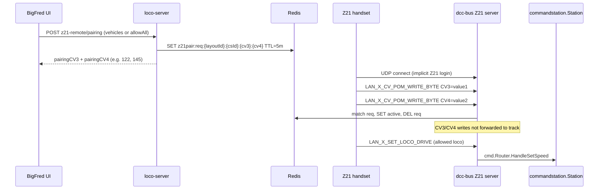
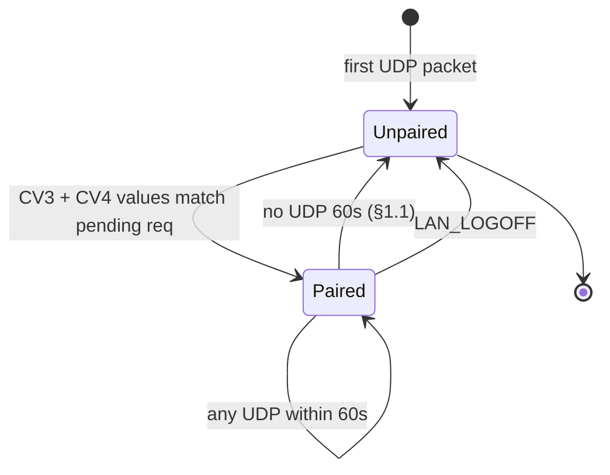
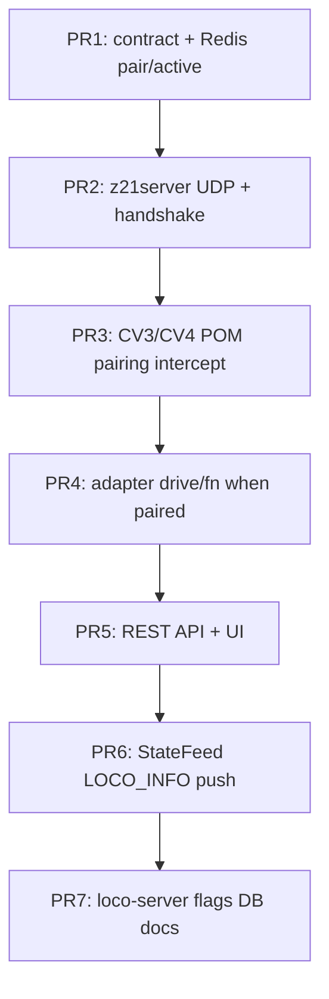

# Implementation plan — Z21 server in dcc-bus

Expose an **optional inbound Z21 LAN UDP server** inside the `dcc-bus` daemon so
physical handsets (Roco Z21 app, Z21 handheld, etc.) can drive locomotives through
the same command path as the browser WebSocket throttle. The server reuses
`cmd.Router` handlers (`HandleSetSpeed`, `HandleSetFunction`, `HandleSubscribe`,
…). It does **not** implement the WebSocket dead-man switch or ping keepalive.

**Pairing model.** Authorization is established when a handset sends
**Programming-on-the-Main (POM) byte writes to CV3 and CV4** with two simple
numeric values shown in the BigFred UI (e.g. **CV3 = 122**, **CV4 = 145**). The
**source UDP endpoint** (`IP + source port`) of those packets is stored in Redis
as the paired Z21 session. Both CV writes are required (any order); writes are
intercepted and never forwarded to the track. The user never computes hashes or
bit patterns — they copy the two numbers from `/remotes/z21` into the Z21 app.

Related specifications:

- Z21 LAN protocol — [`../protos/z21.md`](../protos/z21.md)
- dcc-bus overview — [`../architecture/16-dcc-bus/01-overview-and-goals.md`](../architecture/16-dcc-bus/01-overview-and-goals.md)
- dcc-bus authorization — [`../architecture/16-dcc-bus/05-authorization.md`](../architecture/16-dcc-bus/05-authorization.md)
- Drive roster contract — `bigfred/pkgs/bigfred/contract/allowedvehicles.go`

---

## Goals and architecture

### Target topology

Physical controllers talk UDP to `dcc-bus`, which acts as a **virtual Z21 command
station** and forwards drive commands to the real driver already owned by the
daemon (`Z21Roco`, LocoNet, …).

```text
[Z21 handset] ──UDP :21105──► [dcc-bus Z21 server]
                                    │
                                    ▼
                             cmd.Router (reuse)
                                    │
                                    ▼
                      commandstation.Station ──► [real command station / track]
```

The browser WebSocket throttle and the Z21 server share **one** `cmd.Router`
instance per `dcc-bus` process.

### Confirmed design decisions

1. **Opt-in via Command Station settings (UI).** Layout owners / admins enable the
   inbound Z21 server per command station in the existing **Command Station**
   create/edit dialog (`CommandStationsPage`). The field is persisted as
   `command_stations.z21_server_enabled` (default `false`). Saving triggers the
   usual supervisord rebuild so `dcc-bus` restarts with or without
   `--enable-z21`. CLI flags `--enable-z21`, `--z21-bind`, and `--z21-port`
   remain the daemon surface; `loco-server` sets `--enable-z21` from the DB row
   when spawning the process. Optional advanced fields (`z21_bind`, `z21_port`)
   can live on the same form later; MVP uses daemon defaults (`0.0.0.0:21105`).
2. **No dead-man / no session estop for Z21.** Z21 clients never run
   `watchDeadman`. Session end (§1.1 idle or `LAN_LOGOFF`) drops pairing — **without**
   calling `HandleSessionClose` or layout estop.
3. **Pairing via CV3 + CV4 POM writes.** The handset must write **CV3** and
   **CV4** (wire addresses **2** and **3**, 0-based per Z21 spec) with the two
   byte values shown in `/remotes/z21` for the generated code. Both writes are
   **intercepted** and **never** forwarded to the track. Order does not matter;
   pairing completes when both values were received from the same `clientKey`
   within the pairing window. Loco address inside the POM packets is
   **ignored** for pairing.
4. **Session identity = UDP source endpoint.** `clientKey = "<ip>:<port>"` (source
   port of the datagram(s) that completed pairing).
5. **Scoped vehicle list (fixed or dynamic).** The `/remotes/z21` page lets the
   user choose which layout vehicles the handset may control, **or** enable
   **“all vehicles I can drive”** (`allowAllVehicles: true`). In fixed mode only
   selected DCC addresses are allowed; in dynamic mode `allowedAddrs` is
   recomputed on each drive command from the current `allowed_vehicles` Redis
   snapshot (`ControllerUserIDs`). Both modes still require `DrivePolicy` roster
   membership. Vehicle scope can be changed while paired without re-pairing.
6. **Pairing code TTL = 5 minutes**, single use. Stored in Redis; deleted on
   successful pair.
7. **Pairing values — simple decimal CV entries.** Each of CV3 and CV4 is a
   **single integer 111–255** entered in the Z21 app. Valid values follow a fixed
   **three-digit pattern** (digits are decimal positions, not three separate CV
   writes):

   ```text
   [1–2][1–5][1–5]   →   e.g. 122, 155, 215, 255
    ^   ^   ^
    │   │   └─ ones digit:  1–5
    │   └───── tens digit:  1–5
    └───────── hundreds:   1–2
   ```

   Examples: **CV3 = 122**, **CV4 = 145**. Invalid: `099`, `160`, `312` (fails the
   pattern). **50** valid values per CV → **2 500** possible pairs. The UI shows
   only the two numbers to type; optional shorthand label `122-145` for display.
8. **Pairing generation.** Server picks random valid `pairingCV3` and `pairingCV4`
   independently, stores them on the pending `req`, and rejects duplicate
   `(pairingCV3, pairingCV4)` pairs among concurrent reqs on the same command
   station (retry generation). **No hashing** — handset values match Redis
   literally.
9. **Handshake for everyone.** Unpaired clients still receive
   `LAN_GET_SERIAL_NUMBER`, `LAN_GET_HWINFO`, `LAN_SYSTEMSTATE_GETDATA`, etc., so
   stock Z21 apps can connect and reach the CV programming UI.
10. **Unpaired drive rejected.** `LAN_X_SET_LOCO_DRIVE`, function commands, and
   non-pairing CV writes are dropped until the endpoint is paired.
11. **Dedicated remotes UI.** All handset pairing management lives on
    **`/remotes/z21`** (status, pair, unpair, vehicle scope). Not embedded in the
    throttle overlay.
12. **Session lifetime = Z21 §1.1 + `LAN_LOGOFF`.** The virtual Z21 server
    follows [`../protos/z21.md`](../protos/z21.md) §1.1 and §2.2 — **no separate
    BigFred idle timer**:
    - **Implicit login:** the client’s first UDP packet registers it on the
      active-participant list (e.g. `LAN_SYSTEMSTATE_GETDATA`).
    - **Keepalive:** **any** inbound packet refreshes `LastSeen`; the client must
      send at least one packet per minute (stock Z21 apps usually do).
    - **> 60 s without any UDP:** remove from the active-participant list **and**
      **full unpair** (`DEL active` in Redis). Session and pairing end together.
      No estop.
    - **`LAN_LOGOFF` (header `0x30`):** same as idle timeout — remove from
      participants, **full unpair**, **no reply**. Preferred disconnect path (spec:
      *“If possible, the client should log off using LAN_LOGOFF”*).
    - **After timeout or logoff:** the handset is unpaired; the next connection
      requires CV3/CV4 pairing again (new code from `/remotes/z21`).

### Deliberate non-goals (MVP)

- Turnouts, programming-track CV, LocoNet tunneling, CAN, fast clock
- Custom Z21 headers for BigFred-specific pairing feedback
- Train consists (`train.setSpeed`) from the handset
- Pushing an **allowed locomotive list** to stock Z21 apps (protocol has no such message; see plan § Deliberate non-goals)
- Discovering / listing locos from live Z21 bus state in the UI

---

## Pairing flow



### User-facing steps

1. An admin enables **Z21 handset server** for the command station in **Command
   Station settings** (admin catalogue). Wait for `dcc-bus` to restart.
2. Open **`/remotes/z21`**, pick layout + command station (only stations with
   Z21 server enabled).
3. **If not paired:** choose vehicles (or “all I can drive”), tap **Generate** —
   BigFred shows **CV3 = …** and **CV4 = …** (e.g. `122` and `145`). Enter those
   two values in the Z21 app (POM on any loco).
4. **If paired:** review status (`IP:port`, `pairedAt`, `lastSeen`, allowed
   vehicles); adjust vehicle scope or unpair.
5. In the Z21 app, set the command station IP to the `dcc-bus` host (port
   `21105` unless configured otherwise).
6. Program **CV3** and **CV4** to the exact numbers shown (e.g. **122** and
   **145**) — step 6 only when pairing.
7. The page shows **paired** / **not paired** live (poll or WS). If the handset
   sends no UDP for **> 60 seconds** (Z21 §1.1), it is unpaired automatically;
   user must pair again with a new code.

### CV3 / CV4 addressing and value pattern

Per [`../protos/z21.md`](../protos/z21.md) §6.6, the POM CV address field is
0-based (`0` = CV1):

| Display (UI / Z21 app) | Wire address | Example |
|------------------------|--------------|---------|
| **CV3** | **2** | `122` |
| **CV4** | **3** | `145` |

Documentation and UI copy use “CV3” / “CV4”; implementation uses wire addresses
`2` and `3`. Each value is one integer **111–255** that satisfies
`[1–2][1–5][1–5]` (see decision §7).

**Validation (reference implementation):**

```go
func validPairingCV(v int) bool {
    if v < 111 || v > 255 {
        return false
    }
    d1, d2, d3 := v/100, (v/10)%10, v%10
    return d1 >= 1 && d1 <= 2 && d2 >= 1 && d2 <= 5 && d3 >= 1 && d3 <= 5
}
```

**Why CV3/CV4:** the Z21 app exposes one number per CV (1–255). Two fields give
**2 500** distinct pairs — enough for club use — while staying easy to read and
type (`122`, `145`). Pairing writes are **never forwarded** to the track.

**Pairing buffer (per `clientKey`):** while a pairing `req` is pending, buffer
the received value for CV3 and CV4. When both are present, look up the `req` with
matching `(pairingCV3, pairingCV4)` for this layout/command station and complete
pairing. Clear buffer on success, TTL expiry, or §1.1 idle.

### Z21 participant lifecycle (§1.1 + `LAN_LOGOFF`)

Per [`../protos/z21.md`](../protos/z21.md):

| Event | Active participant (local) | BigFred pairing (Redis) |
|-------|---------------------------|-------------------------|
| First UDP packet | Add / refresh; implicit login | Unchanged until CV3/CV4 pair |
| Any UDP packet while paired | Refresh `LastSeen`; refresh `lastSeenAt` in Redis | Session stays paired |
| **> 60 s** no UDP | Remove from participant list; clear subs/broadcasts | **`DEL active`** (full unpair) |
| **`LAN_LOGOFF`** | Remove from participant list | **`DEL active`** (full unpair) |
| After timeout / logoff | Next UDP = implicit login, **unpaired** | Re-pair via CV3/CV4 required |



**Implementation notes:**

- Sweeper tick for §1.1: e.g. every **15 s**, evict clients where
  `now - LastSeen > 60s` → local eviction **and** `Unpair` in Redis.
- `LAN_LOGOFF` request: `DataLen=0x04`, header `0x30 0x00`, no data, no response.
- User guide: stock Z21 apps keep sending traffic while open; closing the app
  should trigger `LAN_LOGOFF`. Abrupt Wi-Fi loss unpairs after 60 s idle per §1.1.

### Security properties

| Property | Mechanism |
|----------|-----------|
| Short window | Redis TTL 5 min on `req` keys |
| Single use | `DEL req` after successful pair |
| Session lifetime | End after **60 s** without any UDP (Z21 §1.1) or on `LAN_LOGOFF` |
| No decoder damage | CV3/CV4 pairing writes never reach `Station` |
| LAN trust model | Anyone who knows the code within TTL can pair from any IP; acceptable for club LAN; CIDR allow-list is a future option |
| Brute force | 2 500 pairs; 5 min TTL; optional rate limit on pairing (v2) |

---

## Redis contract

Define types and key templates in `bigfred/pkgs/bigfred/contract/` first (project
convention).

### Keys

| Key | TTL | Payload |
|-----|-----|---------|
| `bigfred:z21pair:req:{layoutId}:{csId}:{cv3}:{cv4}` | **5 min** | `{layoutId, commandStationId, userId, pairingCV3, pairingCV4, displayLabel, vehicleIds[], addrs[], allowAllVehicles, createdAt}` — key uses the CV pair for O(1) lookup; `displayLabel` e.g. `"122-145"` for UI only |
| `bigfred:z21pair:active:{layoutId}:{csId}:{clientKey}` | None; evicted on §1.1 idle | `{userId, vehicleIds[], allowedAddrs[], allowAllVehicles, pairedAt, pairingCV3, pairingCV4, lastSeenAt, clientKey}` |
| `bigfred:z21pair:byuser:{layoutId}:{csId}:{userId}` | None | SET of `clientKey` values for listing / revoke |

`clientKey` = `"<ip>:<port>"` using the **source** address of the UDP datagram.

**`allowAllVehicles`:** when `true`, `allowedAddrs` in Redis is informational
only; `z21server` resolves permitted addresses at command time from the live
roster cache (`RosterCache`) filtered by `userId ∈ ControllerUserIDs`. When
`false`, only `allowedAddrs` (or `vehicleIds` resolved to addresses) apply.

**`lastSeenAt`:** unix ms UTC; updated in Redis on **any** inbound UDP packet
while the client is paired. Used for `/remotes/z21` status display. Session ends
when `now - lastSeenAt > 60s` (sweeper) or on `LAN_LOGOFF`.

### Atomic pairing (Lua recommended)

`PairViaCV3CV4(pairingCV3, pairingCV4, clientKey, meta)`:

1. `GET bigfred:z21pair:req:{layoutId}:{csId}:{cv3}:{cv4}` — miss or expired → fail
2. `SET` `active` for `clientKey` copying `allowAllVehicles`, `addrs`, `userId`;
   set `lastSeenAt = now`
3. `DEL` the matched `req` key (and any secondary index)
4. `SADD byuser:…`

**Removed from earlier drafts:** `z21pair:pending:*`, `POST …/confirm`, pending
client list in the UI.

---

## REST API (loco-server)

### Command Station catalogue (enable / disable Z21 server)

Extend the existing command-station CRUD used by `CommandStationsPage`:

| Method | Path | Change |
|--------|------|--------|
| `GET` | `/api/v1/command-stations` | Include `z21ServerEnabled: boolean` on each row. |
| `POST` | `/api/v1/command-stations` | Accept optional `z21ServerEnabled` (default `false`). |
| `PATCH` | `/api/v1/command-stations/{id}` | Accept `z21ServerEnabled`. |

Domain: add `Z21ServerEnabled bool` (`db:"z21_server_enabled"`) to
`domain.CommandStation`. Migration adds the column with default `false`.

On create/update when `z21ServerEnabled` changes (or on any CS save that affects
runtime, consistent with existing behaviour): `DccBusService` rebuilds supervisord
programs for every layout attached to that station so each `dcc-bus` child process
receives `--enable-z21` only when the flag is on.

**Guardrails (UI + API):**

- Pairing endpoints (`z21-remote/*`) return `409` or `400` when
  `z21ServerEnabled` is `false` for the target command station.
- Disabling the flag stops the UDP listener on the next daemon restart; existing
  Redis `active` sessions may be revoked or left to expire (MVP: revoke on
  supervisord rebuild via pairing cleanup hook).

### Z21 handset pairing and remotes

Base path scoped by layout + command station. Used by `/remotes/z21`.

| Method | Path | Description |
|--------|------|-------------|
| `GET` | `/api/v1/layouts/{lid}/command-stations/{csid}/z21-remote` | **Status** for the current user: `{paired, clientKey?, pairedAt?, lastSeenAt?, allowAllVehicles, allowedVehicles[], pendingPairing?}`. `pendingPairing` = `{pairingCV3, pairingCV4, displayLabel, expiresAt}` while a `req` exists for this user. |
| `POST` | `…/z21-remote/pairing` | Start pairing. Body: `{vehicleIds?: string[], allowAllVehicles?: boolean}`. Requires `z21ServerEnabled`. Generates random valid `pairingCV3`/`pairingCV4`. Returns `{pairingCV3, pairingCV4, displayLabel, expiresAt, instructions}`. |
| `PATCH` | `…/z21-remote/session` | Update paired session scope: `{vehicleIds?, allowAllVehicles?}` without re-pairing. |
| `DELETE` | `…/z21-remote/session` | **Unpair** active session for the current user (optional `?clientKey=` if multiple). |

Legacy alias names (`z21-pairing/*`) may be avoided — use `z21-remote` consistently
in new code.

Implementation: `server/cmd/`, `server/http/`, Redis via `server/service/redis.go`.
Vehicle validation reuses `DriveSecurityContext` rules.

---

## dcc-bus package layout

New module beside `ws/`:

```text
dcc-bus/
  z21server/
    server.go           # net.ListenUDP, read loop
    client_registry.go  # map[clientKey]*Client
    pairing.go          # Redis + local cache; TryPairCV3CV4, Session, TouchSeen, Unpair, Sweeper
    dispatch.go         # splitZ21Datagram → handler chain
    adapter.go          # LAN_X_* → cmd.Router
    responder.go        # cmd.Responder → UDP Z21 replies
```

### Daemon wiring (`daemon.go`)

```go
if cfg.EnableZ21 {
    z21Srv := z21server.New(z21server.Config{
        Router:           router,
        Redis:            redis,
        LayoutID:         cfg.LayoutID,
        CommandStationID: cfg.CommandStationID,
        Bind:             cfg.Z21Bind,
        Port:             cfg.Z21Port,
    })
    go z21Srv.Run(ctx)
}
```

### Per-packet dispatch order

1. Refresh `LastSeen` on every datagram; if paired, `TouchSeen(clientKey)` in Redis.
2. If `LAN_LOGOFF` (header `0x30`): remove from participant list, `Unpair`
   in Redis, **return** (no reply).
3. If `LAN_X_CV_POM_WRITE_BYTE` and CV wire address is **2** (CV3) or **3** (CV4):
   - Buffer value; when both CV3 and CV4 received, `pairing.TryPairCV3CV4(...)`
   - **Return** without forwarding (success or incomplete buffer).
4. If client not on participant list: register (implicit login).
5. If client not paired (no Redis `active` for `clientKey`):
   - Allow Z21 **handshake** commands (serial, hwinfo, system state).
   - Reject drive, function, turnout, and other CV commands.
6. If paired:
   - Map packet → `cmd.Router` via adapter with `Z21Actor` + `Z21Responder`.
   - Enforce allowed addresses (`allowAllVehicles` or fixed list) **and**
     `DrivePolicy` roster check.
7. Background **§1.1 sweeper** (~15 s tick): evict clients with `LastSeen` older
   than 60 s → local eviction **and** `Unpair` in Redis.

### Client registry

```go
type Client struct {
    Addr            net.UDPAddr
    Key             string // "ip:port"
    Paired          *PairedSession // mirror of Redis when on participant list
    LastSeen        time.Time      // any UDP packet — Z21 §1.1 keepalive
    BroadcastFlags  uint32
    SubscribedLocos []uint16 // max 16 FIFO per Z21 spec
}
```

See [Z21 participant lifecycle](#z21-participant-lifecycle-11--lan_logoff) for the
full timeout matrix. Summary:

- **`LastSeen` > 60 s:** evict from participant map **and** `Unpair` in Redis; **no** estop.
- **`LAN_LOGOFF`:** same as idle timeout; **no** reply; **no** `HandleSessionClose`.
- **New `clientKey`** (e.g. ephemeral port changed): require CV3/CV4 pair again.

---

## Reusing cmd.Router handlers

| Inbound Z21 packet | Router handler | Notes |
|--------------------|----------------|-------|
| `LAN_X_SET_LOCO_DRIVE` | `HandleSetSpeed` | Decode `RVVVVVVV`, direction, e-stop step |
| `LAN_X_SET_LOCO_FUNCTION` | `HandleSetFunction` | Map `TTNNNNNN` → on/off/toggle |
| `LAN_X_GET_LOCO_INFO` | `HandleSubscribe` + reply `LAN_X_LOCO_INFO` | Per-client subscription FIFO (16) |
| `LAN_X_SET_STOP` | `HandleEStop` | Optional; scope to allowed addrs |
| `LAN_SET_BROADCASTFLAGS` | Local on `Client` | Not routed |
| `LAN_SYSTEMSTATE_GETDATA` | Synthetic reply | Track on, no programming mode |
| `LAN_GET_SERIAL_NUMBER` / `LAN_GET_HWINFO` | Static “BigFred virtual Z21” | Required for stock apps |
| `LAN_LOGOFF` | Remove participant + unpair | **No reply** (§2.2) |

### Z21Actor and Z21Responder

```go
func (a *Adapter) actor(c *Client) cmd.Actor {
    return cmd.Actor{
        UserID:    c.Paired.UserID,
        SessionID: "z21:" + c.Key,
    }
}
```

`Z21Responder` implements `cmd.Responder`:

- `SendLocoState` → build `LAN_X_LOCO_INFO`, send UDP unicast to `c.Addr`
- `SendLocoError` → log; no universal Z21 error frame for drive
- `Subscribe` → update `Client.SubscribedLocos`
- `SendAck` → no-op (Z21 has no request-id acks)

### Drive policy wrapper

`Z21DrivePolicy` (or pre-check in adapter):

- If `session.AllowAllVehicles`: `addr` must appear in roster with
  `userId ∈ ControllerUserIDs` (live `RosterCache`).
- Else: `addr` ∈ `session.AllowedAddrs`.
- Always: `DrivePolicy.CanDrive(userId, vehicle, onLayout)`.

Reject with silence or `LAN_X_UNKNOWN_COMMAND` for drive commands.

### State fan-out

`StateFeed` observations can push `LAN_X_LOCO_INFO` to paired clients that
subscribed to the address and enabled broadcast flag `0x00000001`.

Reuse packet builders from `commandstation/z21_proto.go`; consider extracting
shared encode/decode to `pkgs/loco/z21proto/` for client + server.

---

## Z21 replies required for stock app compatibility

| Request | Response |
|---------|----------|
| `LAN_GET_SERIAL_NUMBER` | Stable serial (config or layout-derived) |
| `LAN_GET_HWINFO` | e.g. `D_HWT_z21_SMALL` or a dedicated virtual type constant |
| `LAN_SYSTEMSTATE_GETDATA` | `SystemState` — track voltage on, no short circuit |
| `LAN_X_GET_LOCO_INFO` | `LAN_X_LOCO_INFO` from Redis / driver function cache |

POM pairing has **no** reply per Z21 spec §6.6. Pairing success is visible on
**`/remotes/z21`** or when drive commands start working.

---

## Frontend

### Route: `/remotes/z21`

New top-level page (`web/src/pages/remotes/Z21RemotePage.tsx`), registered in
the app router and linked from the main nav (e.g. “Remotes” / “Z21 handset”).

**Prerequisites shown when disabled:** if no command station on the layout has
`z21ServerEnabled`, display an info alert pointing to Command Station settings.

**Page sections:**

| Section | Not paired | Paired |
|---------|------------|--------|
| **Status** | “Not paired”; link to enable CS if needed | `clientKey` (`IP:port`), `pairedAt`, `lastSeenAt`, hint: keepalive ≥1 packet/min (§1.1) |
| **Pending pair** | **CV3 = …** / **CV4 = …** (large type) + expiry countdown | — |
| **Layout / CS picker** | Required | Same (switching CS shows that CS's status) |
| **Vehicle scope** | Multi-select roster vehicles **or** toggle **“All vehicles I can drive”** (`allowAllVehicles`) | Same controls; `PATCH …/z21-remote/session` on save |
| **Pair** | “Generate” → e.g. **CV3 = 122**, **CV4 = 145** + 5-min TTL | Hidden or “Re-pair” (unpair first) |
| **Unpair** | — | “Disconnect handset” → `DELETE …/z21-remote/session` |

**Data:** `GET …/z21-remote` on load and after mutations; optional WS event
`z21.remote.changed` for live status. i18n namespace `z21Remote` (`en`, `pl`,
`de`).

**API client:** `web/src/api/z21_remote.ts` with React Query hooks
(`useZ21RemoteStatus`, `useStartZ21Pairing`, `useUpdateZ21RemoteSession`,
`useUnpairZ21Remote`).

### Command Station settings (enable Z21 server)

Extend the admin **Command Stations** create/edit dialog
(`web/src/pages/admin/CommandStationsPage.tsx`):

- Add a **“Z21 handset server”** toggle (`Switch` or `Checkbox`) bound to
  `z21ServerEnabled`.
- Helper text: physical Z21 apps connect to the `dcc-bus` host on UDP port
  `21105`; pairing uses CV3/CV4 (link to user guide).
- Show the toggle on **create** and **edit**; persist via existing
  `useCreateCommandStation` / `useUpdateCommandStation`.
- i18n keys under `commandStation` locale files (`en`, `pl`, `de`).
- Optional: read-only badge in the catalogue table (“Z21 server on”) when
  enabled.

Disabling the toggle should warn that active handset pairings will stop working
after the daemon restarts.

---

## loco-server and operations

1. **CLI** — `dcc-bus/cli/cli.go`: `--enable-z21`, `--z21-bind`, `--z21-port`.
2. **Supervisord** — `server/service/dcc_bus.go` `buildProgramSpec`: append
   `--enable-z21` when `command_stations.z21_server_enabled` is true for the
   spawned station (not a manual CLI-only switch).
3. **DB migration** — `command_stations.z21_server_enabled BOOLEAN NOT NULL DEFAULT false`.
4. **Admin UI** — toggle on `CommandStationsPage` (see Frontend § Command Station
   settings); sole operator-facing switch for enabling the feature.
5. **Deployment** — UDP `21105` on the `dcc-bus` host. The outbound Z21 client
   (`udp://real-z21:21105`) must use a **different host IP** than the inbound
   listener on the same machine (port conflict).
6. **Docs (user guide)** — `/remotes/z21` walkthrough; CV3/CV4 pairing; **§1.1**
   (≥1 UDP packet per minute while connected); **`LAN_LOGOFF`** on app exit;
   enabling the server under Command Station settings.
7. **Metrics (optional)** — `z21_clients_active`, `z21_packets_rx`, `z21_pair_success`,
   `z21_pair_reject`.

---

## Tests

| Layer | Cases |
|-------|-------|
| Unit | `validPairingCV`; POM CV3/CV4 → `TryPairCV3CV4`; policy rejects non-allowed addr |
| Integration | UDP harness: CV3=122 + CV4=145 → Redis `active`; invalid values rejected |
| Pairing | TTL expiry; wrong CV values; order independence; duplicate pair rejection |
| §1.1 idle | No UDP for 60 s → participant evicted + Redis unpair; any UDP before timeout keeps session |
| LAN_LOGOFF | Full unpair, no reply, no estop |
| Regression | WebSocket throttle + UDP client on same loco via shared `Router` |
| Restart | `dcc-bus` reloads `active` sessions from Redis; sweeper continues |
| UI | `/remotes/z21` paired / not paired states; vehicle scope PATCH |

---

## Pull request sequence



| PR | Scope | Risk |
|----|-------|------|
| 1 | `contract/z21pairing.go` | Low |
| 2 | UDP listen, client registry, handshake packets | Medium |
| 3 | CV3/CV4 intercept, Redis pair, no forward | Medium |
| 4 | Drive/function → Router, Z21Responder | Medium |
| 5 | REST `z21-remote` API + `/remotes/z21` page + CS toggle | Low |
| 6 | Push state to handsets | Medium |
| 7 | Supervisord wiring, user documentation | Low |

---

## Risks and mitigations

| Risk | Mitigation |
|------|------------|
| Pairing space | 2 500 pairs; reject duplicate active `(CV3, CV4)` per CS during TTL |
| Real decoder CV3/CV4 conflict | Never forward CV3/CV4 pairing writes when `--enable-z21` |
| No POM ACK in app | Status on `/remotes/z21` |
| Stale paired session | Z21 §1.1 — unpair after 60 s without any UDP |
| Port 21105 clash with outbound Z21 client | Separate host IP or custom `--z21-port` + user docs |
| Multiple control sources | Same as today: last write wins; audit `source: "z21-handset"` |
| Full Z21 feature surface | Explicit unsupported list; return `LAN_X_UNKNOWN_COMMAND` |

---

## Definition of Done

- [ ] Command Station settings UI exposes **Z21 handset server** toggle; value
      persisted and drives `--enable-z21` via supervisord rebuild.
- [ ] **`/remotes/z21`** shows pairing status, vehicle scope (fixed or all
      drivable), pair / unpair flows, and live session metadata.
- [ ] `dcc-bus --enable-z21` listens on UDP and answers Z21 handshake.
- [ ] UI-generated **CV3/CV4** pair (TTL 5 min) pairs a client after both POM writes
      (only when Z21 server enabled for that CS). User copies numbers only — no encoding.
- [ ] Redis session keyed by `(layoutId, commandStationId, IP, port)` with
      configurable vehicle scope (`allowAllVehicles` or explicit list).
- [ ] CV3/CV4 pairing writes are **not** sent to the track.
- [ ] Unpaired clients cannot drive; paired clients respect vehicle scope +
      roster `DrivePolicy`.
- [ ] **60 seconds** without any UDP ends session and unpairs (Z21 §1.1); no estop.
- [ ] `LAN_LOGOFF` ends session and unpairs; no reply; no dead-man.
- [ ] Paired clients reuse the same `cmd.Router` handlers as WebSocket.
- [ ] User documentation covers Command Station settings, `/remotes/z21`, Z21 app
      IP setup, CV3/CV4 pairing, §1.1 keepalive (≥1 packet/min), and `LAN_LOGOFF`.
