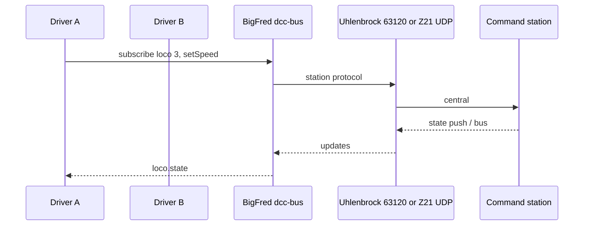

# 5. BigFred integration

BigFred connects via a **command-station catalogue row** (`kind` + `connection_uri`).
The Pi 5 host is the same; the kind depends on the central — see §1.2.

| Central | Kind | Details |
|---------|------|---------|
| **DR5000** | `loconet_serial` | §5.1–§5.5 below (Uhlenbrock 63120) |
| **RB1110** | `z21` | [§7](./07-z21-command-stations.md) |
| **Other Z21 + LocoNet** | `z21` or `loconet_serial` | Best-effort — [§7.5](./07-z21-command-stations.md#75-dual-protocol-centrals-best-effort) |

---

## 5.1 LocoNet serial — serial device (DR5000)

| Link | Device path |
|------|-------------|
| Uhlenbrock 63120 → Pi 5 USB 3 | `/dev/ttyACM0` (typical) |
| After udev rule (§3.5) | `/dev/loconet-63120` |

Pin the path with a **udev** rule on the Uhlenbrock 63120 USB VID/PID. Add the service user
to group **`dialout`**.

## 5.2 LocoNet serial — connection URI

[`pkgs/bigfred/dcc-bus/service/station/driver.go`](../../../pkgs/bigfred/dcc-bus/service/station/driver.go):

| Field | Value |
|-------|-------|
| Kind | `loconet_serial` |
| URI | `serial:///dev/loconet-63120:57600` |
| Speed steps | `128` |

**Prerequisite:** LNCV **57600** + **LocoNet Direktmodus** on Uhlenbrock 63120 (§4.2).

## 5.3 LocoNet — catalogue and daemon

Command stations are **admin-only**
([`command_station.go`](../../../pkgs/bigfred/server/domain/command_station.go)):

1. Create e.g. `DR5000 (LocoNet)`, kind `loconet_serial`, URI as above.
2. Attach to a layout (`POST /api/v1/layouts/{id}/command-stations`).
3. `dcc-bus` opens the serial device (`--station-kind loconet_serial`).

## 5.4 LocoNet — driver limits

[`loconet.go`](../../../pkgs/loco/commandstation/loconet.go): speed/dir, **F0–F28**
(F0–F8 via slot DIRF/SND, F9–F28 via `OPC_IMM_PACKET`), observe (incl. F9–F28), and
**CV read/write on the programming track** (service-mode direct byte). No F29+, no
POM CV (RailCom), no accessory/sensor control over LocoNet.

## 5.5 Z21 — catalogue and daemon (RB1110)

| Field | Value |
|-------|-------|
| Kind | `z21` |
| URI | `udp://192.168.x.x:21105` (RB1110 IP; port defaults to 21105) |
| Speed steps | `128` |

Full setup: [§7](./07-z21-command-stations.md). Broader function/CV surface in
[`z21.go`](../../../pkgs/loco/commandstation/z21.go).

---

## 5.6 Multi-user hub (both kinds)

- **One `dcc-bus` daemon** per `(layout × command station)`.
- **Sessions, takeover, shared observation** — same hub semantics.
- LocoNet: MultiMaus on the bus; Z21: `LAN_X_LOCO_INFO` push path.

## 5.7 Operational rules

| Rule | LocoNet | Z21 |
|------|---------|-----|
| Single writer | Do not open serial with minicom/JMRI | Avoid second Z21 master app |
| Hardware | One Uhlenbrock 63120 per `loconet_serial` row | Stable IP; UDP 21105 open |
| Host | NVMe root (§3) | Same |
| RB1110 | Do not use Uhlenbrock 63120 for supported path | Use `z21` only |

Continue with [§6 Bring-up](./06-bringup-and-testing.md) or [§7 Z21](./07-z21-command-stations.md).
